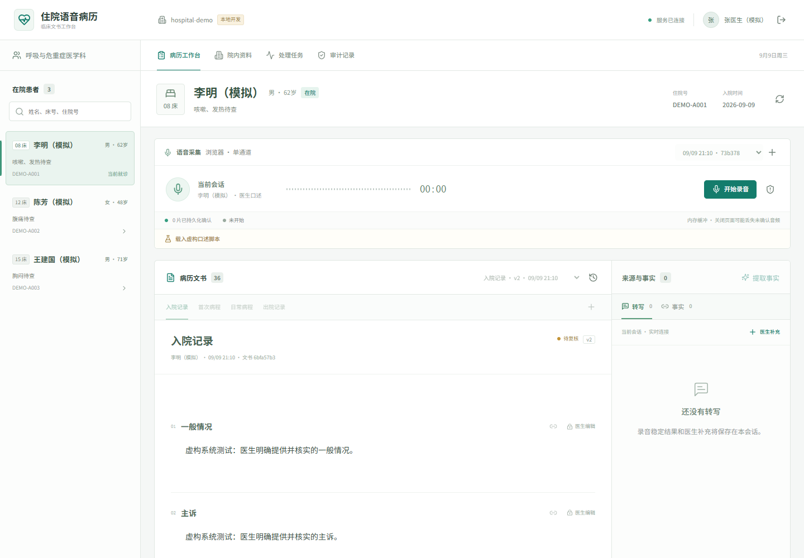
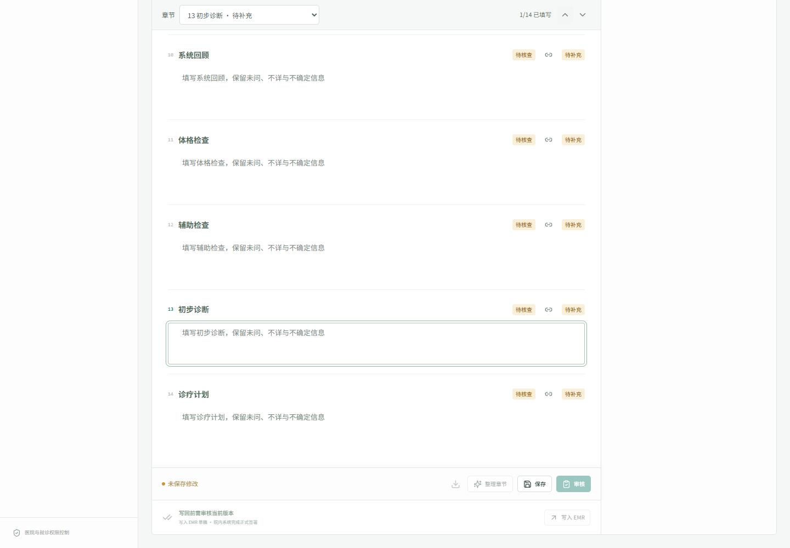
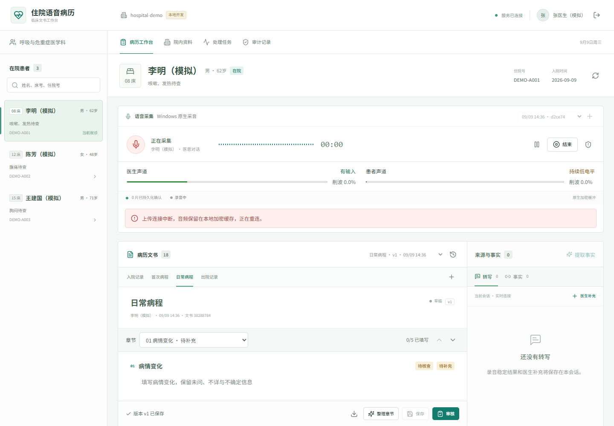
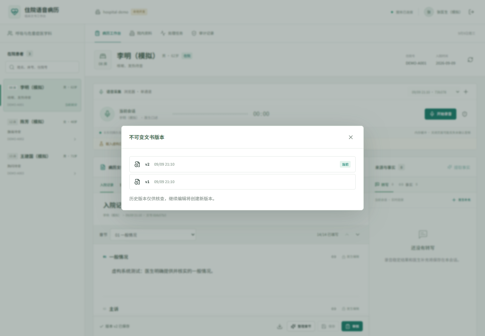
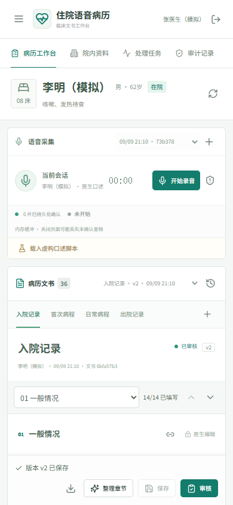
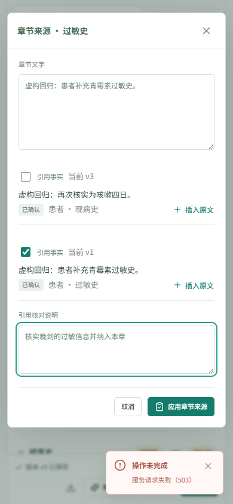
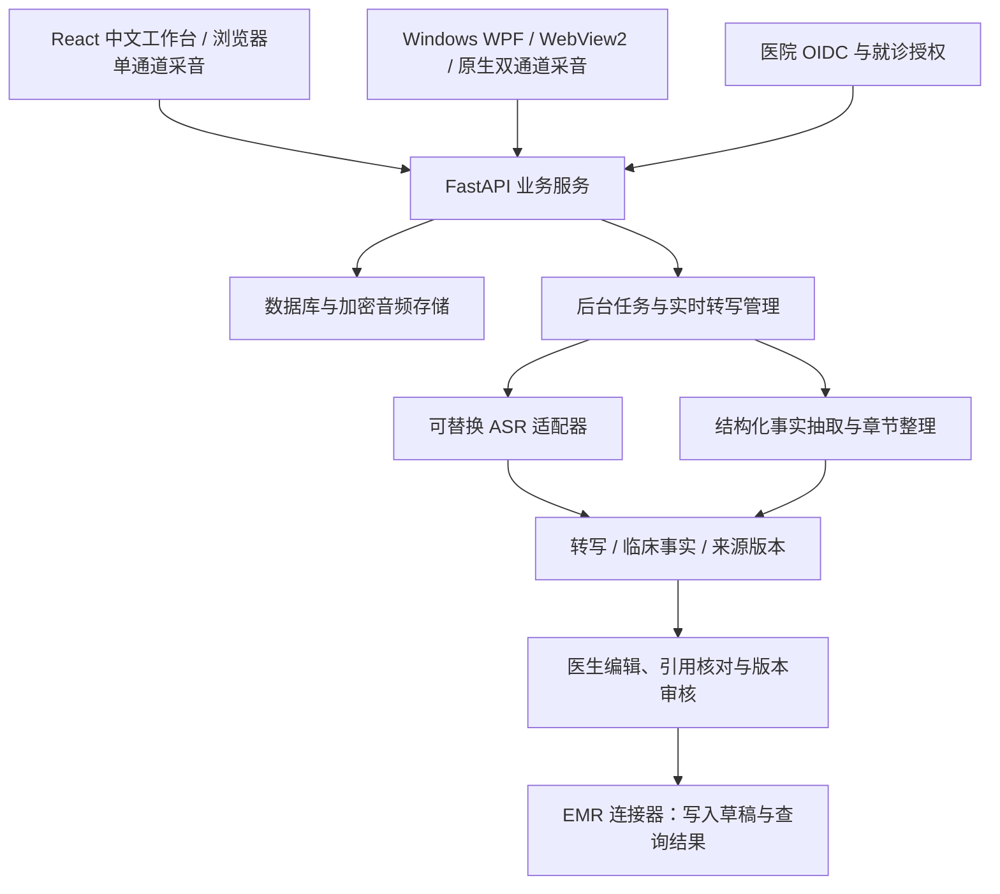

# 住院语音病历工作台

**面向住院医生，把语音采集、病史整理、来源核对和病历审核放在同一个工作台。**

**许可：源码可见，仅限非商业使用。** 二次开发需署名 **Yongzhi Li (chnoorlee)** 并引用[原仓库](https://github.com/chnoorlee/HIS-)；商业用途需另行书面授权。详见 [LICENSE](LICENSE) 与[许可证与署名](#许可证与署名)。

项目聚焦住院办公室中的医生口述和医患对话，提供中文 Web 工作台、Windows 原生采音端、后端文书服务，以及可替换的 ASR、大模型和 EMR 连接器。医生可以沿着“录音 → 转写 → 临床事实 → 住院文书 → 审核 → EMR 草稿”的流程完成病历整理。

当前已实现可本地运行的工程第一版。默认使用**虚构病例、演示模型和模拟 EMR**，真实 ASR 默认未配置。真实识别效果、嘈杂环境鲁棒性与医院上线验收仍需实测；本项目不自动完成正式病历签署。

[界面预览](#界面预览) · [核心功能](#核心功能) · [使用流程](#使用流程) · [快速启动](#快速启动) · [技术架构](#技术架构) · [开发与验证](#开发与验证) · [项目文档](#项目文档) · [许可证与署名](#许可证与署名)



*桌面工作台实截图。左侧选择在院患者，中部编辑病历，右侧查看转写和临床事实。图中姓名、住院号与病历文字均为模拟数据。*

## 界面预览

以下图片来自 **2026-09-09 的本地界面回归记录**，与当前仓库中的工作台实现对应。本次文档整理未重新采集截图；长页面仅裁切展示区域，没有改写界面文字或拼接产品状态。[截图来源与处理说明](docs/screenshots/README.md) 记录了各图的场景与边界。

### 章节定位与长篇病历编辑

按章节跳转，查看填写进度与待补充项，保留医生正在编辑的内容。入院记录提供 14 个章节，不需要在长篇文书中反复寻找输入位置。



### 双声道状态与上传异常提示

Windows 原生采音模式分别显示医生、患者声道的输入状态、持续低电平和削波情况。上传连接中断时，工作台明确显示本地加密缓存与重连状态。



*此图使用合成的原生桥事件验证异常界面。它展示状态反馈，不代表真实双麦实测、自动说话人分离或降噪效果。*

### 文书版本记录

保存产生新的文书版本，历史版本用于核查；审核绑定具体的已保存版本，后续修改需要重新审核。



### 手机浏览与章节来源核对

工作台支持窄屏布局。医生可以查看患者与文书，也可以在章节来源弹窗中选择引用事实、插入原文、填写核对说明。

<p>
  
  
</p>

*左图为移动浏览器布局，右图为注入 HTTP 503 后的引用核对界面，展示失败提示与保留的编辑内容。手机端是响应式 Web 页面，目前没有 Android 或 iOS 原生安装包。*

## 核心功能

### 1. 固定患者与就诊的工作台

- 按姓名、床号、住院号搜索在院患者，查看科室、入院时间和本次就诊。
- 录音会话绑定患者与住院就诊，支持医生口述及医患对话模式。
- 采集中限制切换患者，后端按医院、用户和就诊权限校验访问。
- 在病历工作台、院内资料、处理任务、审计记录之间切换；审计和系统设置按角色开放。

### 2. 语音采集与故障恢复

| 能力 | 浏览器采音 | Windows 原生采音 |
| --- | --- | --- |
| 输入方式 | 单通道麦克风 | 显式选择一个或两个 WASAPI 设备 |
| 音频格式 | 转换为 16 kHz PCM | 16 kHz PCM，独立声道 |
| 录音控制 | 开始、暂停、恢复、结束 | 通过 WebView2 桥控制原生采音 |
| 待确认音频 | 页面内存缓冲，关闭页面有丢失风险 | DPAPI 保护密钥、AES-GCM 加密磁盘缓存 |
| 上传确认 | 分片坐标、哈希、持久化 ACK | 分片坐标、哈希、持久化 ACK 与恢复协议 |
| 故障提示 | 输入中断、失败状态与待处理分片 | 分声道电平、低电平、削波、数据过期及上传异常 |

服务端根据连续音频范围与最终清单检查完整性，不能仅凭“点击结束”把缺失音频标记为完成。针对断网、重复发送、确认丢失和未结束会话已有受控回归；实体设备拔插、长录音、休眠恢复仍需现场验证。

浏览器会请求设备的回声消除和噪声抑制能力，但这不等于已经具备经过验证的办公室降噪或背景谈话隔离能力。

### 3. 实时转写与有来源的事实整理

- ASR 接入层支持 DashScope 双向流协议适配和兼容 HTTP ASR 服务，保留声道及音频坐标；HTTP 接口不等同于双向实时流。
- 稳定转写与医生补充进入事实整理流程；转写角色和陈述主体可修正，存在对应音频时可核查原音。
- 临床事实保留来源引文、主体、时间、肯定/否定/不确定状态以及确认版本。
- 事实可由医生核查、修正、确认或说明原因排除；家属病史不能直接当作患者病史。
- 未问、未知剂量、停用药物与不确定信息应保留原始状态，不能自动补成“无异常”。

章节整理以已有事实及其 ID 为输入，由服务端组织来源文本。当前并非任意自由生成完整病历或诊疗结论的写作模式；结构校验与来源约束也不能代替医生判断模型是否理解正确。真实模型抽取需要配置兼容 LLM 服务，演示脚本不用于展示真实模型质量。

### 4. 四类住院文书

| 文书 | 章节数 | 内容 |
| --- | --- | --- |
| 入院记录 | 14 | 一般情况、主诉、现病史、既往史、用药史、过敏史、个人史、婚育史、家族史、系统回顾、体格检查、辅助检查、初步诊断、诊疗计划 |
| 首次病程 | 4 | 病例特点、初步诊断、诊断依据与鉴别分析、诊疗计划 |
| 日常病程 | 5 | 病情变化、查体与观察、检查结果变化、医生评估、诊疗计划 |
| 出院记录 | 6 | 入院诊断、出院诊断、住院经过、出院情况、出院用药、随访安排 |

支持逐章编辑、章节跳转、填写进度、缺项定位、来源查看及 TXT 草稿下载。诊断、查体、评估、诊疗计划等内容有医生来源约束，不能仅凭患者口述自动形成结论。科室模板与完整性规则仍需院方确认。

### 5. 引用核对与医生审核

- **逐章引用版本：** 每章保存所引用事实的版本快照；事实变更后，普通保存不会自动把旧引用更新为已核对。
- **新增事实处置：** 文书形成后新增的适用事实，需要纳入章节或明确排除并说明原因。
- **修改保护：** 切换文书前可保存、放弃或继续编辑；保存失败与版本冲突会保留本地修改。
- **明确审核对象：** 审核针对已保存的具体版本，缺项、过期来源或未处理事实会阻止通过。
- **历史可查：** 文书版本、事实修正与审核操作保留记录，便于追溯。

例如，患者在生成入院记录后补充过敏史，医生需要核查该事实并处理相应章节；只保存原来的病历不会自动解除这一待核对状态。详细规则见 [文书引用核对](docs/reference-review.md)。

### 6. EMR 草稿回写

已实现审核版本检查、草稿写回记录、操作幂等键、结果查询与已签署目标保护。远端可能成功但响应超时时，操作进入“结果未知”，需要查询核实，不能直接重复提交。

默认连接器为 `mock`。真实院方接口需要约定患者映射、草稿、签署、幂等和查询语义；本系统的审核不等于医院正式签署。正式签署与归档继续在医院 EMR 完成。

### 7. 身份、审计与运维

- OIDC 授权码 + PKCE 身份接入、令牌校验和就诊授权；开发账号路径仅在开发环境使用。
- 后台任务支持租约、代次和旧结果拦截，避免迟到模型结果覆盖医生修改。
- 支持录音隔离、音频到期清理、派生内容处理和删除清单。
- 提供恢复隔离、身份重新导入、备份恢复与 EMR 恢复窗口核查流程。
- 提供 SQLite 本机开发方式，以及 PostgreSQL、独立 worker 和音频卷的 Compose 环境。

## 使用流程

1. **登录并核对患者。** 选择正确住院就诊，确认姓名、床号与住院号。
2. **建立录音会话。** 选择医生口述或医患对话；原生端先选择采音设备。
3. **采集或补充信息。** 配置真实 ASR 后使用录音转写；本地演示可使用“载入虚构口述脚本”或“医生补充”。
4. **检查来源与事实。** 核对说话角色、患者/家属主体、否定与不确定信息，处理错误或无关事实。
5. **创建并整理文书。** 选择文书类型，填写缺项，核对章节引用，保存当前版本。
6. **审核与回写。** 处理阻断项，审核明确版本，再提交 EMR 草稿；模拟环境可查看模拟写回结果。
7. **后续补充。** 新事实或来源更正发生后，重新核对受影响章节并审核新版本。

## 快速启动

### 环境准备

| 组件 | 要求 | 用途 |
| --- | --- | --- |
| Git | 可用的 Git 命令行 | 获取项目 |
| Python | 3.12 | 后端与适配器 |
| Node.js / npm | Node.js 22 或更高 | 前端安装、构建与运行 |
| Windows PowerShell | 可执行仓库脚本 | 本机安装、启停和测试 |
| .NET SDK / WebView2 | .NET 10 SDK、WebView2 Runtime，可选 | Windows 原生采音端 |
| Docker Compose | 可选，Docker 引擎需启动 | PostgreSQL 容器开发环境 |

### 启动 Web 工作台

在 Windows PowerShell 中执行：

```powershell
git clone https://github.com/chnoorlee/HIS-.git
cd HIS-
powershell -ExecutionPolicy Bypass -File scripts/setup.ps1
powershell -ExecutionPolicy Bypass -File scripts/start.ps1
```

安装脚本创建 Python 虚拟环境、安装依赖，并在首次安装时生成 `.local/runtime.env` 和 `.local/compose.env`。这些文件含本机密钥，已排除版本控制。需要指定 Python 时，可给 `setup.ps1` 传入 `-Python` 和解释器路径。

| 入口 | 默认地址 |
| --- | --- |
| 医生工作台 | http://127.0.0.1:5173 |
| API 文档 | http://127.0.0.1:8787/docs |

仅供虚构病例本地验证的开发账号：

| 角色 | 用户名 | 密码 |
| --- | --- | --- |
| 医生 | `doctor` | `Doctor123!` |
| 审核者 | `reviewer` | `Reviewer123!` |
| 管理员 | `admin` | `Admin123!` |

医生可编辑、审核并导出；审核者还可查看审计和隔离事件；管理员负责配置、授权与清理，默认没有临床编辑角色。目前未强制要求另一位医生进行双人审核。

登录医生账号后，选择模拟患者并建立会话，即可使用虚构口述脚本体验事实整理与文书核对。默认未配置真实 ASR，录音上传成功不表示已经完成语音识别。

端口占用时指定其他端口；停止项目使用配套脚本：

```powershell
powershell -ExecutionPolicy Bypass -File scripts/start.ps1 -ApiPort 8789 -WebPort 5175
powershell -ExecutionPolicy Bypass -File scripts/stop.ps1
```

### 构建 Windows 原生采音端

先安装 .NET 10 SDK 和 WebView2 Runtime，并启动前述本地服务，再执行：

```powershell
powershell -ExecutionPolicy Bypass -File desktop/publish.ps1
& ./desktop/artifacts/win-x64/HisVoice.Desktop.exe
```

仓库提供源码，**不包含预先构建的 EXE**。默认连接本机 `5173` 工作台和 `8787` API；使用其他端口时同步调整 `desktop/HisVoice.Desktop/desktop.settings.json` 后再发布。设备选择、双通道及缓存恢复说明见 [原生客户端文档](desktop/README.md)。

### PostgreSQL 容器环境

先执行上面的 `scripts/setup.ps1` 生成 `.local/compose.env`，并确认 Docker 引擎已启动，然后运行：

```powershell
docker compose --env-file .local/compose.env up --build -d
docker compose --env-file .local/compose.env ps
```

工作台端口为 `5180`，API 为 `8788`，PostgreSQL 仅绑定本机 `55432`。该组合包含数据库、API、独立 worker 和加密音频存储，默认仍是虚构数据与模拟 EMR 的开发环境。

### 配置真实服务

| 接入项 | 配置入口 | 需要准备的内容 |
| --- | --- | --- |
| ASR | `HIS_ASR_PROVIDER` 及 ASR 配置 | 批准的服务地址、模型、凭据与音频协议 |
| 大模型 | `HIS_MODEL_PROVIDER` 及 LLM 配置 | 兼容接口、模型名、凭据和结构化输出能力 |
| 医院身份源 | OIDC 配置及用户/就诊授权导入 | issuer、client、回调地址、院内身份映射 |
| EMR/HIS | EMR 配置及连接器 | 草稿写入、结果查询、幂等键和签署状态契约 |

开发启停脚本读取 `.local/runtime.env`。配置字段以 [服务端配置](backend/app/config.py) 为准，[环境变量示例](backend/.env.example) 提供常用配置。部署前需配置批准的端点和主机白名单；具体步骤见 [安装与恢复手册](docs/operations.md) 与 [ASR 接口说明](integrations/asr/README.md)。生产模式禁止 SQLite、开发身份、演示模型和模拟 EMR；正式部署应配置 OIDC、PostgreSQL 及已批准的真实服务，并单独验收 ASR/LLM 可用性。

## 技术架构



| 层次 | 当前技术 |
| --- | --- |
| Web | React 19、TypeScript、Vite、Lucide、响应式 CSS |
| 采音客户端 | C# / .NET 10、WPF、WebView2、WASAPI |
| 后端 | Python、FastAPI、SQLAlchemy、Alembic |
| 数据与任务 | SQLite / PostgreSQL、持久任务与事件、独立 worker |
| 集成 | DashScope 实时协议、HTTP ASR、兼容 LLM API、OIDC、EMR 连接器 |
| 部署 | PowerShell、Docker Compose、Nginx |

业务服务采用模块化单体，采音与外部模型通过明确接口解耦。更完整的接口、故障状态和模块边界见 [实现契约](docs/implementation-contract.md)。

## 开发与验证

### 执行检查

完成安装后，在仓库根目录执行后端、ASR 适配器、前端单元测试与前端构建：

```powershell
powershell -ExecutionPolicy Bypass -File scripts/test.ps1
```

运行原生端及浏览器回归时，还需 .NET 10 SDK、已安装的 Microsoft Edge 和运行中的本地开发服务。当前前端依赖清单未包含 Playwright，先在**仓库根目录**补齐测试依赖：

```powershell
npm install --no-save --package-lock=false playwright
powershell -ExecutionPolicy Bypass -File scripts/test.ps1 -Desktop -E2E
```

使用自定义 Web 端口时设置 `HIS_E2E_URL`。浏览器回归会创建和修改测试文书，只应对虚构数据开发环境运行。PostgreSQL 并发测试需将 `HIS_TEST_POSTGRES_URL` 指向专用测试数据库；测试使用独立随机 schema，默认 SQLite 会跳过依赖 PostgreSQL 行锁的用例。

### 已记录的验证结果

以下为 **2026-09-09 验收记录**，不是 CI 实时状态，也不是本次 README 更新重新执行的结果。

| 范围 | 记录结果 |
| --- | --- |
| 后端完整回归 | PostgreSQL 上 117 passed，零跳过 |
| ASR 适配器契约 | 10 passed |
| 前端单元测试 | 13 passed |
| 工作台浏览器回归 | 14 passed |
| 文书操作回归 | 11 passed |
| 跨模块流程 | 7 passed |
| Windows 核心与传输 | 52 passed |
| 前端生产构建 | 通过 |

这些检查覆盖来源版本、并发修改、录音分片、输入故障、审核阻断、模拟回写和界面恢复。它们不测量真实 ASR 准确率或临床效果。详细证据、历史记录与待验收项见 [实现与验收记录](docs/implementation-progress.md)。

## 当前边界与后续方向

| 方向 | 当前状态 | 下一步 |
| --- | --- | --- |
| 嘈杂办公室识别 | 已有采音质量提示、角色修正和 ASR 接口 | 使用真实双麦、方言、多人打断及否定词语料评估 |
| 临床事实质量 | 已有结构、引用、主体及审核约束 | 建立医生标注金标准，测量遗漏、错误归属与修正负担 |
| 医院互联 | 已有身份与 EMR 接入边界、模拟流程 | 接入实际院内系统并验证幂等、签署和授权语义 |
| 历史资料 | 可查看已导入的结构化来源 | 尚无独立扫描 PDF / OCR 管线 |
| 移动端 | 已有响应式浏览器工作台 | 实体手机录音与网络恢复需单独验证，无原生移动包 |
| 生产交付 | 已有容器、迁移、清理与恢复工具 | 完成真实设备、部署、负载、备份恢复和院方验收 |

## 目录结构

```text
HIS-/
  backend/          API、临床事实、文书、权限、迁移与后端测试
  frontend/         中文医生工作台、浏览器采音与界面回归
  desktop/          Windows 原生采音端及核心/传输测试
  integrations/asr/ ASR 实时协议适配
  tests/            跨模块流程与集成测试
  docs/             接口契约、运维手册、验收记录与软件截图
  infra/            前端容器与 Nginx 配置
  scripts/          安装、启停与测试脚本
  compose.yaml      PostgreSQL 开发环境
```

## 项目文档

| 文档 | 内容 |
| --- | --- |
| [项目架构设计](住院语音病历系统_项目架构设计.md) | 模块边界、接口与交付设计 |
| [竞品研究与商业化蓝图](住院语音病历系统_竞品研究与商业化蓝图.md) | 初始产品研究与商业化思路，时效以文档日期为准 |
| [嘈杂办公室验证与试点方案](嘈杂办公室_验证与试点方案.md) | 噪声、多主体和故障场景的试点设计 |
| [实现契约](docs/implementation-contract.md) | 状态、数据与服务接口约束 |
| [事实抽取契约](docs/extraction-contract.md) | 引文、主体、时间及不确定性处理 |
| [文书引用核对](docs/reference-review.md) | 逐章来源快照、新事实处置与冲突处理 |
| [实现与验收记录](docs/implementation-progress.md) | 已交付能力、回归记录与未验证事项 |
| [安装与恢复手册](docs/operations.md) | 配置、身份导入、部署、备份与恢复 |
| [Windows 原生客户端](desktop/README.md) | 设备、采音、缓存与发布 |
| [截图来源说明](docs/screenshots/README.md) | 实截图场景、模拟数据及裁切方式 |

提交问题或参与开发时，请使用虚构或经过授权处理的样例，附上复现步骤、环境版本与预期行为。不要把患者资料、录音、访问令牌、`.local/` 或本机环境变量文件提交到公开仓库。

## 许可证与署名

本项目采用 **HIS- Noncommercial Attribution License 1.0**，这是一份自定义的非商业署名许可证。版权署名为 **Copyright (c) 2026 Yongzhi Li (chnoorlee)**。完整英文条款见 [LICENSE](LICENSE)，需要保留的署名信息见 [NOTICE](NOTICE)；本节为中文摘要，以 LICENSE 为准。

| 行为 | 许可要求 |
| --- | --- |
| 非商业学习、研究、教学、试验与协作开发 | 可以使用、复制、运行和修改，但实际用途须符合非商业定义 |
| 非商业分发源码、编译产物或衍生项目 | 可以分发，须保留许可证、版权与署名信息，并标明修改 |
| 分发的衍生项目的 README 或等效项目文档 | 须明确署名原作者并链接原仓库 |
| 向其他用户提供 App 或托管服务，包括内部用户 | 须在易于访问的“关于 / 致谢 / 法律声明”展示署名；无图形界面时可使用等效用户文档 |
| 销售、收费 SaaS、付费部署 / 集成 / 支持、商业产品集成或商业经营使用 | 本许可证不授权，须事先获得相关著作权人的另行书面许可 |
| 私人修改 | 不要求仅因使用或修改就公开源码 |

非商业性质按用途判断：医院、学校或公益机构的身份不会自动豁免商业用途；产品免费也不当然代表非商业。署名不能代替商业授权。第三方依赖、模型和服务仍受各自的许可证或服务条款约束。

二次开发时，请在上述文档和适用的 App / 服务署名位置保留以下信息；支持超链接的地方应将仓库地址设为可点击链接：

```text
本项目基于 HIS-（https://github.com/chnoorlee/HIS-）开发。
原作者：Yongzhi Li (chnoorlee)。
许可证：HIS- Noncommercial Attribution License 1.0。
```

发布修改版本时还须说明主要修改内容，不得暗示衍生项目获得原作者背书或属于原作者的官方发布。原有代码及其复制部分继续受本许可证约束，不能通过更换衍生项目许可证取消这些限制。

由于限制商业用途，本项目属于 **source-available（源码可见）**，不属于 [OSI 开源定义](https://opensource.org/osd)下的开源软件。商业授权可联系[原作者 chnoorlee](https://github.com/chnoorlee)，以另行书面许可为准。
