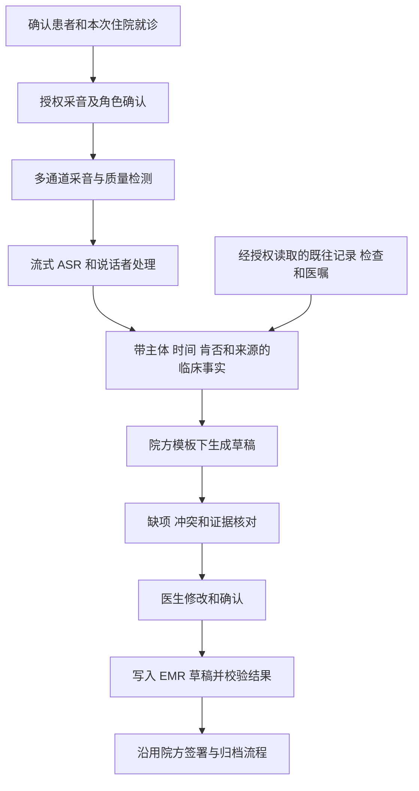

# 住院语音病历系统：竞品研究与商业化蓝图

调研截止：2026-09-08。目标用户：在中国医院嘈杂住院办公室书写病历的医生。本文交付市场研究和产品方案，尚未开发软件、接入医院或完成实地性能测试。

## 1. 建议先做什么

建议定位为 **“面向嘈杂住院办公室、可追溯的住院病历工作台”**。同时支持医生与患者/家属的对话采集，以及医生在办公室补充口述查体、诊断分析和计划。首版以入院记录为主，有限支持由医生提供判断内容的首次病程记录。

你的 ASR + 大模型思路是可行的基础链路，但商业产品还需要采音、患者身份绑定、信息来源管理、院内数据接入、医生审核、权限和运维。竞争力应体现在：真实办公室里少听错关键事实，生成内容容易核查，总书写时间确实下降。

第一家试点客户建议选择：**有科室负责人推动、信息科愿意配合、能明确数据使用边界的一家二级或三级医院中的一个住院科室**，先覆盖 10-20 名医生。专科优先服从实际合作资源；在资源相同的情况下，可从普通内科病区筛选，暂不以 ICU、抢救或复杂多团队会诊作为首个验收范围。这是项目选择建议，不是市场调查结论。

首轮需现场确认一个重要假设：病人是否确实在办公室接受问诊。若问诊主要发生在床旁，办公室只是医生整理病历的地点，就应让便携采音端负责床旁对话，电脑端负责整理审核；不能仅录办公室声音便承诺获得完整医患交流。

## 2. 市面上的代表性解决方案

这里的“主流”指值得采购比较和产品对标的代表厂商，不是按市场份额排列。公开资料不足以给出可比的中国住院语音病历市占率。官网说明用于确认厂商公开提供什么，不直接证明真实噪声表现或临床效果。

### 2.1 国内产品与解决方案

| 厂商/方案 | 本次核实到的公开能力 | 对本项目的意义与证据边界 |
| --- | --- | --- |
| 讯飞医疗：医疗语音、病历生成与质控方案 | 官方介绍软硬件采集、医患角色分离、实时转写、病历生成和内涵质控 | 最直接的国内对标对象之一。需现场核实具体住院文书、并发人声场景、部署方式和接口费用；没有据此认定其嘈杂办公室准确率 |
| 云知声：语音电子病历、医疗 AI 与采音硬件 | 官方公司介绍记载与北京协和医院合作推出语音电子病历方案；当前官网列出医疗 Agent、医疗文本/OCR、ASR 和降噪麦克风阵列 | 值得同时比较语音底座、麦克风和医院交付能力。历史语音电子病历案例不等于当前所有产品均具备完整医患对话生成能力 |
| 卫宁健康：WiNGPT / WiNEX Copilot | 上市公司报告披露文书生成、病历质控等 AI 场景 | 重点学习电子病历内嵌工作流及医院渠道。其 AI 场景覆盖数量不能当作语音病历装机数量；公开材料未充分验证本需求的强噪声采音能力 |
| 浪潮云：海若大模型病历生成方案 | 官方方案描述角色分离、语音转写、病历生成、质控及确认导入 | 可作为一体化交付的补充比较对象；具体可采购版本、医院接口适配和噪声实测仍需确认 |

来源：[讯飞医疗病历生成与质控介绍](https://www.xunfeihealthcare.com/news/182/1111.html)、[讯飞医疗语音开发平台](https://health.xfyun.cn/)、[云知声公司介绍](https://unisound.com/about-company)、[云知声当前产品目录](https://unisound.com/)、[卫宁健康 2025 年半年度报告摘要](https://static.cninfo.com.cn/finalpage/2025-08-23/1224557517.PDF)、[浪潮云方案介绍](https://cloud.inspur.com/about-inspurcloud/about-us/news/All-News/4142.html)。卫宁的依据为明确注明日期的披露文件，不代表其后续全部版本情况。

### 2.2 国际产品

| 产品 | 已公开的重点能力 | 最值得借鉴的部分 | 不能直接外推的部分 |
| --- | --- | --- | --- |
| Microsoft Dragon Copilot | 2025 年发布，将医疗听写与 DAX 环境式记录能力纳入统一助手；面向多种临床工作流 | 成熟语音输入、临床文书及工作流结合 | DAX 是其技术与产品沿革中的重要部分，不宜当作另一个完全独立的当前竞品；国外部署不证明适配中国医院 |
| Abridge | 对话生成记录、Linked Evidence 核对来源，以及住院病程记录能力 | 从记录返回证据，结合历史信息处理住院期间变化 | 有证据链接仍需验证主体、时间和否定关系；中国模板、方言和院内部署要另行确认 |
| Ambience Healthcare | 住院入院记录、日常病程、既往内容变化提示、患者列表同步和出院总结 | 与本项目最接近的“入院到出院”完整产品方向 | 官网能力说明不等于独立性能验证；美国编码与支付规则不能直接移植到中国 |
| Suki | 环境式记录、语音操作、电子病历双向集成，并提供平台/API/SDK | 把记录能力嵌入现有软件，减少医生切换应用 | 多语言听取不自动意味着中文住院病历输出、国内部署及本院接口已具备 |
| Nabla | 对话记录、听写、电子病历嵌入、桌面外接麦克风及移动端 | 轻量使用、嵌入式审核、录音和数据保留控制 | 本次查看的 Epic 页面仍把基于已签署记录/已有草稿的连续病程更新标为即将支持，不能当作已完整上线 |

来源：[Dragon Copilot 发布说明，2025-03-03](https://news.microsoft.com/2025/03/03/microsoft-dragon-copilot-provides-the-healthcare-industrys-first-unified-voice-ai-assistant-that-enables-clinicians-to-streamline-clinical-documentation-surface-information-and-automate-task/)、[Abridge 产品](https://www.abridge.com/product)、[Abridge 来源核对](https://support.abridge.com/hc/en-us/articles/30235128433811-Verify-a-Note-With-Linked-Evidence)、[Abridge 住院病程介绍，2025-08-19](https://www.abridge.com/blog/inpatient-progress-notes)、[Ambience 住院产品](https://www.ambiencehealthcare.com/inpatient)、[Suki EHR 集成](https://www.suki.ai/ehr-integrations/)、[Suki 平台](https://www.suki.ai/suki-platform/)、[Nabla Epic 集成及功能状态](https://www.nabla.com/epic)。

这些产品说明，商业竞争已经延伸到既往记录读取、文书审核、医院系统写回和部署交付。首版可以在一个限定场景里对标它们，但不能凭一个演示宣称达到其全院、全专科服务能力。

### 2.3 如何理解“效果很好”

2025 年发表的一项随机试验纳入 238 名门诊医生，比较 DAX、Nabla 和常规工作。Nabla 相对对照的电子病历内书写时间下降约 9.5%；DAX 的差异未达到统计学显著。医生仍报告过记录不准确。这支持开展真实工作流验证，不能推出中国住院办公室中的效果，也不能据此排名 2026 年产品版本。[原始论文及摘要](https://pubmed.ncbi.nlm.nih.gov/41497288/)

因此，采购或开发时应测量“采集、补问、回听、修改、审核、写回”的完整用时，不能把模型生成速度或厂商案例中的效率数字直接写进收益承诺。

## 3. 住院病历需要哪些信息

门诊和住院病历都要求真实、准确；住院文书的内容及持续记录要求更复杂。病历资料来自问诊、查体、检查和诊疗活动，患者口述只能覆盖其中一部分。入院记录通常需在入院后 24 小时内完成，首次病程记录在 8 小时内完成；产品应按适用规范及院方制度配置时间要求。[《病历书写基本规范》，卫医政发〔2010〕11 号](https://www.nhc.gov.cn/wjw/gfxwj/201002/79d42b9c8b3f47ee91000d31de116784.shtml)

| 信息类型 | 主要来源 | 首版生成边界 |
| --- | --- | --- |
| 主诉、现病史、既往史、手术史、输血史、过敏史、个人史、家族史等 | 患者/家属口述，既往病历，医生补问 | 保留陈述者、时间和确定性；未询问、记不清、明确否认分别处理 |
| 婚育史、月经史等适用内容 | 适用患者的问诊和既往资料 | 按院方模板与临床适用性处理，不向全部患者机械填充 |
| 体格检查、专科检查 | 医生实际查体后输入或已确认记录 | 没有证据就待补充，不能用正常模板填满 |
| 辅助检查 | LIS、影像报告、病理报告、院外材料等 | 保留检查日期、单位、来源；院外 OCR 结果先核实 |
| 初步诊断、鉴别诊断、诊断依据、诊疗计划 | 医生判断，结合病史与检查 | 整理医生提供的内容，缺少判断则提示补充 |
| 日常病程与出院总结 | 多日记录、医嘱、检查变化、查房和会诊意见 | 第二阶段增加；不能把昨天病情默认复制为今天事实 |

完整住院病历还包括多种记录、医嘱和知情同意材料。首版应准确命名为“入院记录与首次病程书写辅助”，避免让用户误以为一次录音即可完成整个住院病案。

## 4. 强鲁棒性首先是采音系统设计

### 4.1 推荐的采音配置

| 场景 | 起步方案 | 原因与限制 |
| --- | --- | --- |
| 医生单独补充口述 | 靠近嘴部的有线 USB 耳麦或近讲麦克风 | 优先提高目标声音占比；需验证长时间佩戴和院内终端兼容性 |
| 医患面对面对话 | 医生近讲麦克风 + 靠近患者的定向麦克风，尽量独立声道 | 两侧都能采集；双声道也有串音，不能直接把声道当作身份 |
| 家属共同回答 | 保留独立说话者标签，允许人工标记家属及其陈述对象 | 家属说自己的疾病与代述患者病史必须区分 |
| 不便佩戴设备 | 经现场验证的桌面阵列或定向设备 | 作为可选方案；越远、同时说话越多，越难保证关键内容恢复 |

办公室中央放一个手机或全向麦克风，靠大模型事后分清所有人的方案，不适合作为高可靠首版的唯一采音方式。若目标语音已经被其他人的声音完全遮蔽，软件无法保证恢复原话。采购时应比较整套采音与识别效果，而非只比较 API。

### 4.2 不同问题需要不同处理

| 问题 | 所需处理 | 常见误区 |
| --- | --- | --- |
| 空调、风扇、键盘等环境声 | 近讲采音、降噪、适当增益控制 | 把“降噪”当作可以删除一切干扰 |
| 旁边医生也在说话 | 定向/多通道采音、目标说话者约束、会话归属核对 | 识别出一句医学术语就纳入当前患者 |
| 医生与患者重叠说话 | 重叠检测、经验证的分离模型、必要时补问 | 把说话人分段当作声音分离 |
| 房间回响、远距离或小声 | 改善设备位置、采音质量检测、场景适配 | 靠增大音量恢复已经丢失的信息 |
| 方言、老年人口音、药品名 | 分层语料测试、医学词表、热词和必要的适配训练 | 把“支持中文”视为覆盖所有口音和药名 |

VAD 用来识别语音活动；说话人分段用于区分声音片段；语音分离尝试拆开混合声音；角色识别判断谁是医生/患者/家属。四者不能互相替代，也都不能单独证明患者身份。

界面应持续显示当前患者、录音状态和采音异常。发生静音、麦克风断开、削波、严重重叠或不确定词时提供可操作提示。原音与增强音应在授权评测中比较，因为降噪也可能削弱小声说出的“不”等关键字。

## 5. 从转写到病历的可靠链路

### 5.1 保留事实层

建议每个临床事实至少携带以下信息，数据结构是设计建议，尚未实现：

| 字段 | 用途 |
| --- | --- |
| `patient_id`、`encounter_id` | 绑定患者与此次住院，服务端校验访问权限 |
| `speaker_role`、`subject` | 分开记录谁说的，以及描述的是谁 |
| `concept`、`value`、`unit` | 症状、疾病、药物、数值及单位 |
| `polarity`、`certainty` | 阳性/否认/未知，以及确诊、疑似或患者自述 |
| `event_time`、`recorded_at` | 临床事件发生时间与系统记录时间 |
| `source_type`、`source_id`、`source_span` | 对话、医生补充、检查或既往文书及其具体位置 |
| `audio_start_ms`、`audio_end_ms` | 在允许留存音频期间定位原话 |
| `verification_state`、`version` | 待核实、医生确认、已被更正及版本关系 |

录音删除后不能继续显示可回听的假链接；允许保留的文字来源和修订记录应按院方数据分类策略管理。来源存在也不自动证明生成句子正确，还必须校验主体、肯否、时间与原文是否一致。

### 5.2 必须防住的错误

| 输入情况 | 应生成/提示 | 禁止行为 |
| --- | --- | --- |
| 患者说“我爸有糖尿病” | 父亲糖尿病家族史 | 写成患者患糖尿病 |
| 过敏问题尚未询问 | 过敏史待补充 | 自动写“无药物过敏史” |
| 患者说“以前吃过，现在停了” | 既往用药，当前已停，时间待明确时标记 | 当作当前规律服药 |
| 患者说“药名记不得” | 名称不详，待核实 | 根据疾病猜测药品名称 |
| 医生说“考虑某诊断，待检查” | 保留考虑和待明确状态 | 改为已确诊 |
| 旁边医生说另一床患者的病情 | 排除或隔离待人工判断 | 自动并入当前会话事实 |
| 既往记录与本次口述矛盾 | 两个来源并列提示核实 | 无提示地按最新输入覆盖 |

大模型可做事实提取、组织语言和冲突提示；涉及药名、剂量、单位、数值、否定词和主体归属时，再使用结构校验、来源比对和人工确认。让同一个模型再问自己一遍不能作为唯一质量保障；模型自报置信度也不能直接视为可信概率。

### 5.3 实时体验与最终准确性分开设计

实时显示暂定转写，稳定片段再进入事实提取。结束后可对高风险片段进行二次识别，并基于稳定事实生成草稿。草稿以增量方式更新，医生已确认的内容应受版本保护；新信息通过差异提示呈现。

录音过程中切换患者必须显式结束或重新建立会话。模型超时、网络重连、重复回调、院内记录刷新都不能重复写入或覆盖医生修改。已签署文书的更正必须走院方更正流程。

## 6. App 形态和首版功能

### 6.1 电脑为主，手机为辅

建议首版采用 **Windows 采音客户端 + Web 病历工作台/EMR 内嵌页面**。电脑更适合长文书编辑、键盘操作和住院医生已有系统；独立采音组件便于处理设备、音频通道和异常恢复。若医院实际终端为其他系统，应先验证兼容性再确定客户端技术。

移动端第二阶段用于床旁录音、补充口述和待核实项目查看。不能让医生长期在个人手机上搬运患者录音、聊天记录或病历截图来维持核心流程。

| 界面/能力 | 首版应具备的行为 |
| --- | --- |
| 当前患者与会话 | 院内登录、床位/患者列表、明确就诊绑定、开始/暂停/结束 |
| 采音与转写 | 设备选择、输入质量、角色标签、回听、原话纠错 |
| 病历编辑 | 本院模板、结构化章节、医生补充口述、局部修改、撤销与版本 |
| 待核实面板 | 缺项、来源冲突、药品剂量和不确定词定位 |
| 来源查看 | 生成内容定位到转写片段或具体院内记录 |
| 审核与写回 | 明确草稿状态、医生确认、授权写回、成功结果校验和失败处理 |
| 管理功能 | 科室模板、权限、留存策略、审计、模型版本、运行状态 |

第一版不承诺全专科覆盖、自动签名、自主开医嘱、自主诊断、全办公室持续监听或替代整个 HIS。日常病程和出院记录在首版可靠性、院内数据接入成熟后增加。

## 7. 技术选型与医院集成

### 7.1 先比较，再选 ASR

| 候选路线 | 用来验证什么 | 采购/工程核实点 |
| --- | --- | --- |
| 讯飞医疗流式语音能力 | 医学词汇、中文口音及医疗交付 | 热词、音频格式、时间戳、并发、数据条款、私有部署报价 |
| 阿里云 Fun-ASR 实时 API | 通用中文流式能力、成本和部署便利性 | 必须核实具体版本；官方功能表区分实时识别和非实时说话人分离能力 |
| 开源 FunASR 组件 | 院内部署、可控版本和长期成本 | 流式模型、VAD、标点、说话者组件需要集成；逐个检查模型许可及资源需求 |

资料：[讯飞医疗平台](https://health.xfyun.cn/)、[阿里云语音模型功能表](https://www.alibabacloud.com/help/zh/model-studio/asr-model/)、[FunASR 官方仓库](https://github.com/modelscope/FunASR/blob/main/README_zh.md)。截至本次查阅，不能把 Fun-ASR 非实时版本的说话人分离能力直接算给其实时接口。

在同一批授权录音上比较三种候选与不同麦克风配置。先看关键事实和修改成本，再看字错率与价格。无需从零训练基础语音模型；只有收集到稳定、足量的真实错误样本后，再决定是否做声学或领域适配。

大模型也采用同样方法：比较获准使用的境内 API 与有适用商用许可的本地模型，围绕事实提取、来源一致性和模板生成评估。产品不依赖某个模型在医学考试上的分数；模型名称、版本、提示词、词表和模板都应可追踪和回滚。

### 7.2 克制的系统结构

初期可采用 React/TypeScript 工作台、适配医院终端的采音组件、一个模块化后端和独立推理任务进程。后端用团队熟悉的 Python/FastAPI 或既有 Java 技术体系择一，结构化数据用关系数据库，允许留存的音频用加密对象存储。先实现清晰职责和恢复能力，无需一开始拆出大量微服务或多智能体。

必须覆盖：服务端租户/科室/患者权限、流式连接恢复、音频分片序号与重传、加密缓存及过期删除、模型调用限流、失败重试、幂等写回、版本冲突、备份恢复、可观测性和受控升级。运行日志默认不记录原始病历正文或录音内容。

### 7.3 对接的是具体系统和接口

| 系统 | 常见接入内容 |
| --- | --- |
| HIS/患者主索引 | 患者身份、住院就诊、床位和医生关系 |
| EMR | 历史文书、模板、草稿、审核与签署状态 |
| LIS | 检验项目、结果、单位、时间 |
| RIS/PACS/病理系统 | 报告及其时间、版本与来源 |
| 医嘱系统 | 药品、剂量、途径、频次、生效/停用状态 |

优先使用院方和原厂授权接口。支持 HL7/FHIR 的医院可以利用标准，其他医院需要适配其接口平台或专有服务；不能假定全国医院已经提供统一 FHIR 接口。首期必须拿到目标医院的接口文档、字段映射、测试环境和原厂配合范围。

先完成最小闭环：患者选择、必要资料读取、生成草稿、医生确认、写回草稿、回读核验。正式签署沿用院内流程。屏幕自动粘贴可用于受控演示，但不应当作已完成稳定生产集成；也不应绕过原厂直接写生产数据库。

## 8. 数据和产品合规设计

以下是应落实的产品要求及法律核实事项，不代表已取得部署许可或完成法律审查。

| 事项 | 对产品的具体要求 | 依据 |
| --- | --- | --- |
| 医疗健康信息属于敏感个人信息 | 明确处理目的、必要性、合法性基础、告知及适用同意要求；涉及敏感信息和委托处理等按要求做影响评估 | [《个人信息保护法》](https://www.cac.gov.cn/2021-08/20/c_1631050028355286.htm) |
| 嘈杂办公室有旁人和其他患者 | 缩小采集范围、可见录音状态、暂停与误录处置；患者拒绝录音时有正常服务路径 | 将个人信息最小必要原则落实为采音设计，不能默认一次诊疗授权覆盖全办公室录音 |
| 境内存储与外部模型调用 | 优先院内部署或医院认可的境内受控部署；逐项约定供应商留存、人工访问、训练使用、转委托及删除 | [健康医疗大数据管理办法（试行）](https://www.nhc.gov.cn/mohwsbwstjxxzx/s8553/201809/742308fad8ed47fb85b9675ee4b6c6eb.shtml) |
| 正式文书可追溯 | 操作者身份、修改痕迹、时间、确认及归档规则；草稿和已签署文书状态分开 | [《电子病历应用管理规范（试行）》](https://www.nhc.gov.cn/wjw/c100175/201702/90f3de8ae03d488cbddf509dc958f75b.shtml) |
| 留存期限 | 正式住院电子病历要求与录音缓存分开制定；不能把住院病历不少于 30 年的要求直接套给全部原始录音 | 同上，第十九条及院方数据分类、病案管理制度 |
| 网络安全 | 根据系统实际定级和适用要求落实等保、权限、加密、审计和恢复 | 医疗大数据办法等适用要求；不能未定级便断言所有部署必须同一级别 |
| 生成式 AI 服务适用范围 | 区分面向境内公众提供服务与院内非公众应用，并检查其他适用规则 | [《生成式人工智能服务管理暂行办法》第二条](https://www.cac.gov.cn/2023-07/13/c_1690898327029107.htm) |
| 是否属于医疗器械 | 由预期用途、实际功能和风险判断；若增加诊断或治疗决策功能，重新开展分类评估 | [国家药监局人工智能医用软件分类界定指导原则发布说明](https://english.nmpa.gov.cn/2021-07/08/c_660267.htm) |

不能默认处理医疗信息的唯一合法性基础都是同意，应结合《个人信息保护法》第十三条等判断具体情形；也不能把诊疗所需处理扩展成无限录音、跨境上传或训练许可。即使去掉姓名，声音、病史组合和罕见事件仍可能识别个人。

合同需写清医院与供应商职责，区分服务所需处理、产品分析和模型训练。错误样本进入研发数据集要有单独明确的使用依据。删除应覆盖缓存、对象存储、转写、索引及供应商副本，并按约定处理备份到期清理；研究发表所需伦理流程也应另行判断。

## 9. 如何证明可以商业化

配套文件《嘈杂办公室_验证与试点方案.md》给出了可执行矩阵。核心原则是：关键事实准确率、覆盖率、噪声分层和总工作时间一起报告，避免靠大量弃答或少写内容取得好看的正确率。

建议把以下数值作为双方讨论的工程目标，全部尚未实测，也不是行业标准：

| 维度 | 初步目标/判定方式 |
| --- | --- |
| 关键临床事实 | 支持声学条件下，精确率和召回率分别争取达到 99%；按药名、剂量、肯否、主体和时态拆开报告 |
| 严重错误 | 验收集中不接受跨患者串入、关键剂量编造或否定反转；发现后暂停相关自动生成路径并调查 |
| 证据 | 应有来源的生成事实均能定位真实来源，同时验证来源是否支持该事实 |
| 不确定性 | 统计待核实/补问比例和被遗漏但原音可听清的事实，不能通过全量弃答过关 |
| 效率 | 稳定使用后总文书工作时间降低 30% 作为验证目标，且错误负担不增加 |
| 交互 | 定义清楚计时起点后，稳定转写 P95 争取不超过 2 秒；20 分钟会话结束后的最终草稿 P95 争取不超过 30 秒 |

这些目标需要在约定硬件、网络、并发、病例复杂度和噪声范围内验证。零次观察错误不等于零风险，尤其不能用少量演示保证所有办公室场景。

## 10. 开发路线和预算

### 10.1 按证据推进的路线

| 阶段 | 预计投入时段 | 交付和进入下一阶段的条件 |
| --- | --- | --- |
| 场景与采音验证 | 第 1-4 周 | 现场流程观察、模板与接口清单、合规边界、麦克风和 ASR 配对测试；证明目标声音可以稳定获取 |
| 单科室工程原型 | 第 5-12 周 | 会话绑定、实时转写、事实提取、入院草稿、来源核对、医生补充和版本保护；先用模拟/合规授权数据 |
| 受控医院试点 | 第 4-6 个月 | 一家医院真实接口、医生全量审核、质量抽查、运维恢复、成本和时间测量；满足约定验收后讨论付费扩展 |
| 可复制产品 | 第 7-12 个月及以后 | 第二家医院或第二科室复现效果，完善日常病程/出院记录和配置化交付 |

时间是以合作医院、数据授权、接口配合和团队到位为前提的规划，不是交付承诺。医院采购和审批可能跨越更长周期。半年可以争取做出受控商业试点，不能据此保证达到头部厂商全部能力。

### 10.2 六个月团队预算示例

假设团队为 6 个全职当量：语音/音频、LLM/数据、客户端、后端/集成、测试、产品/实施各一个方向，另有参与评审的临床专家。部分角色可由同一人承担，但所需工作不会因此消失。

| 项目 | 假设与估算 |
| --- | --- |
| 人员综合成本 | 6 人 × 6 月 × 每人每月 3-5 万元 = 108-180 万元 |
| 设备、云/算力试用、临床标注评审、实施与安全工作预留 | 暂估 20-60 万元，须询价和确认参与方承担范围 |
| 合计 | 约 128-240 万元，适合作为该团队规模下六个月的规划范围 |

这是自建方案的显式假设，非竞品报价。未覆盖未知的大规模 GPU 集群、多院长期驻场、复杂接口改造、长期销售成本或医疗器械注册等可能新增事项。创始人自研、已有医院接口及设备可降低现金支出，但不能把演示版成本等同于商业交付成本。

### 10.3 推理成本怎样算

本次官方价格页列出北京地域 `fun-asr-realtime` 原价为 0.00033 元/秒，即约 0.0198 元/分钟。一段 20 分钟音频单路约 0.396 元；若两条独立流各送入 20 分钟，按同单价估算约 0.792 元。二次识别、重试和其他服务另算。[阿里云官方价格](https://help.aliyun.com/en/model-studio/model-pricing)

LLM 的通用预算公式为：输入 token 数 × 输入单价 + 输出 token 数 × 输出单价，按计价单位折算。假设单次输入 12,000 token、输出 3,000 token，单价分别为每百万 token 5 元和 15 元，则一次约 0.105 元。这里的 LLM 单价只是算例，不是某款当前模型的报价；多轮提取、校验和重生成会继续增加费用。

真实每份病历成本还包括采音设备折旧、存储、审核/标注、集成支持、运维、失败重试和客户服务。私有部署应按服务器、利用率、峰值并发及维护成本计算，不能拿云 API 单价直接推导。

## 11. 商业策略与可持续优势

建议先以医院或科室为单位做有期限、有验收条件的付费试点，再转院级订阅/授权；接口实施、硬件、运维和新增模板的边界单列。具体售价应由试点效益、预算来源、交付成本和竞争报价共同决定，本次未获得可比较的正式厂商报价。

用户是住院医生，推动者可能是科主任，采购与上线还涉及信息科、医务/病案管理、数据与安全人员。个人医生喜欢使用不等于医院可以采购和接入，应同时验证“有人用”和“有人付费”。

一个纯假设的收益算例：20 名医生每天各写 4 份适用文书，每月 22 天，每份节约 5 分钟，对应约 146.7 小时/月。它只是释放的时间，不自动等于工资节省、增加收入或减少人员。试点必须实测文书数量和含审核的净节约时间。

最值得积累的四类资产是：经合法授权的中文临床噪声错误样本及标注体系；可复用的院方模板与临床事实规则；稳定的 EMR 接口适配；可追溯、可恢复、方便医生纠错的工作流。基础模型调用本身较难构成长期差异。

可选路径：直接采购成熟方案适合希望尽快院内部署的团队；购买语音/模型底座并自建工作流适合本项目的首版；完全自研声学基础模型则需要额外数据和研究投入。若现场比较显示现成方案已满足需求且总成本更低，采购或合作集成也可能优于全面自建。

## 12. 下一步应拿到的具体材料

1. 一个科室的实际问诊与书写流程，包括患者是在办公室还是床旁接受问诊。
2. 经允许提供的空白入院记录、首次病程模板，以及医生实际修改最频繁的章节。
3. 目标电脑系统、可用接口、账号权限和原 EMR 厂商的配合条件。
4. 经授权的现场采音评测条件，至少比较近讲、双侧近距离和桌面阵列方案。
5. 与医生共同定义的关键事实、严重错误和完整用时验收方法。
6. 同一验收集下对讯飞医疗、云知声等候选的演示、接口与部署报价要求。

优先投资“能在真实环境获得清楚声音，并生成医生愿意核查和使用的草稿”这个闭环。达到这一点后，再扩大到跨日病程、查房、会诊和出院记录。
