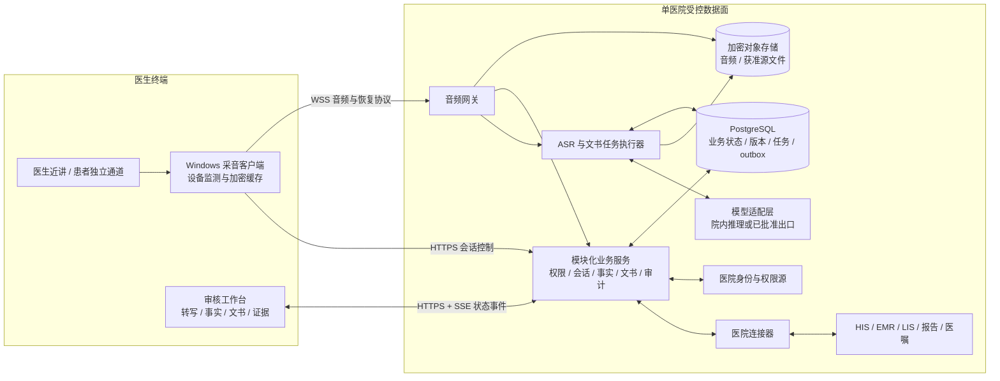
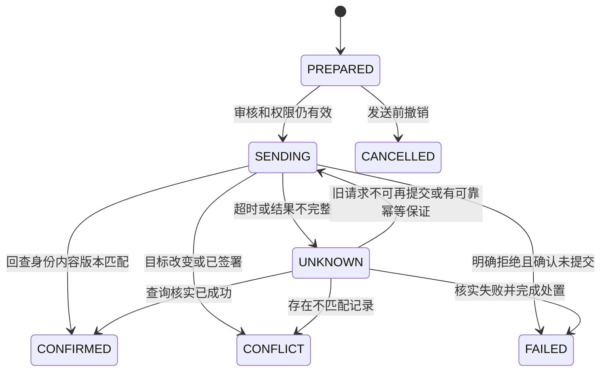
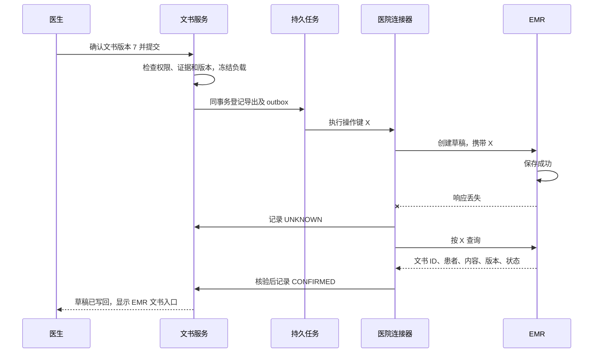

# 住院语音病历系统：项目架构设计

版本：1.0，研发评审稿。日期：2026-09-09。

适用对象：在嘈杂住院办公室书写病历的医生，同时覆盖医生补充口述、患者/家属在场的病史采集。本文给出拟建设系统的架构与验收设计，不表示软件已实现、已通过临床验证或已获医院上线许可。性能、容量与期限均为待验证的设计目标。

配套材料：[竞品研究与商业化蓝图](<C:/Users/Chnoor/Desktop/HIS语音病例/住院语音病历系统_竞品研究与商业化蓝图.md>)、[嘈杂办公室验证与试点方案](<C:/Users/Chnoor/Desktop/HIS语音病例/嘈杂办公室_验证与试点方案.md>)。本文承接这两份材料，重点回答如何实现、如何处理失败、如何交付。

## 1. 架构结论与首期边界

推荐建设“Windows 采音客户端 + 医生审核工作台 + 院内文书服务 + 可替换的 ASR/大模型 + 医院系统连接器”。业务服务采用模块化单体，音频接入与模型推理独立部署。医院 EMR 继续负责正式病历、签署和归档。

核心产品资产是可追溯的临床事实、可靠的医生审核和医院写回流程。ASR 与大模型通过适配接口采购或部署，先比较现有方案的现场表现，再决定是否开展专项模型训练。

| 维度 | 首期明确选择 | 扩展方向与前提 |
| --- | --- | --- |
| 客户与规模 | 一家医院、一个科室、10-20 名医生；设计负载为同时 10 个双通道会话 | 第二科室、第二医院通过独立验证后扩展 |
| 终端 | 医生办公室 Windows 电脑，外接近讲麦克风；医患对话增加患者侧独立通道 | 床旁移动采音复用同一会话协议，另做设备和后台录音验证 |
| 文书 | 入院记录；首次病程只整理医生已提供的分析、诊断依据和计划 | 日常病程、会诊、出院记录沿用同一事实层，增加跨日资料和专用模板 |
| 输出 | 实时转写、分节草稿、来源核查、缺项与冲突、医生补充、受控 EMR 草稿写回 | 签署仍使用院内身份与工作流；后续扩展不自动改变此边界 |
| 临床判断 | 整理明确来源，保留疑似、不详与冲突 | 增加诊断或治疗建议前，单独评估预期用途、分类与临床验证要求 |
| 部署 | 优先医院内网数据面；模型可院内部署或调用院方批准的境内服务 | 每家医院单独批准模型出口和数据策略，不能故障时自动转公共 API |

有患者口述不等于具备完整住院病历。查体、专科检查、辅助检查、诊断分析和计划分别依赖医生观察、院内资料及医生判断；缺少这些来源时，系统必须指出缺项。

## 2. 从商业产品迁移的设计经验

以下公开信息核实于 2026-09-09。左栏是厂商公开的产品行为，右栏是本项目的工程推导。公开资料不能证明厂商采用本文件中的数据库、队列或算法，也不能替代本地噪声测试。

| 商业产品与已公开行为 | 本项目采用的设计 | 外推边界 |
| --- | --- | --- |
| Abridge：选择病历文字，可以定位转写并回放对应音频。[官方操作说明](https://support.abridge.com/hc/en-us/articles/30235128433811-Verify-a-Note-With-Linked-Evidence) | 病历段落关联事实，事实关联有版本的转写和音频范围；来源变更触发复核 | 有来源链接不代表语义正确，音频回放还受留存期限限制 |
| Ambience：住院产品整合入院、日常病程及出院文书，结合检验、药物、生命体征和会诊，突出相对前日的变化。[住院产品页](https://www.ambiencehealthcare.com/inpatient) | 按住院就诊构建资料快照和时间线；不同文书使用不同时间窗与事实范围 | 不照搬美国编码/支付功能；不能将自动更新解释为改写已签署记录 |
| Nabla：公开桌面外接麦、EMR 嵌入及移动入口；默认不存音频，提供保留策略配置。[Epic 集成页](https://www.nabla.com/epic) | 桌面优先，审核界面嵌入原工作台；各类数据分别设置生命周期 | 同页的连续病程更新仍标注即将支持；无音频持久化和长期原音核验不能同时默认成立 |
| Suki：双向 EHR 数据读取与分节写回，以及面向合作方的 API/SDK。[集成说明](https://www.suki.ai/ehr-integrations/) | 文书服务与医院适配器解耦；增加本项目所需的幂等、冲突处理、回读核验 | 这些一致性机制是我们的设计；不能由其海外集成推断中国 HIS 接口通用 |
| 讯飞医疗：公开软硬件采音、医患角色分离、实时转写、病历生成与质控组合。[2026-06-05 官方发布](https://www.xunfeihealthcare.com/news/182/1111.html) | 设备、摆位、音频质量、术语识别、生成和质控共同验收 | 该发布没有给出本项目噪声条件下的对照结果，不能直接承诺现场准确率 |

因此，商业对标应比较整条工作流的净用时、错误和恢复能力。采购验收需要厂商在相同虚构脚本、麦克风条件和测试 EMR 中完成演示，不能只比较一份生成样例。

## 3. 不可破坏的系统约束

| 编号 | 约束 | 实现位置 |
| --- | --- | --- |
| I01 | 录音会话固定医院、患者和住院就诊标识；姓名、床号只供显示 | 会话服务、服务端鉴权、数据库复合约束 |
| I02 | 声道、说话者身份、临床主体分别表示；不能把家属的病史归给患者 | 角色标注、事实模型、审核界面 |
| I03 | 未问、否认、不确定、冲突、无法核实分别保留；不自动补正常查体、剂量或诊断 | 事实模型、生成约束、规则校验 |
| I04 | 每个自动生成的临床断言都有支持来源；医生新增内容记录医生来源 | 来源关系、生成后校验、审核 |
| I05 | 模型不能后台覆盖医生修改或确认；来源变化使相关审核失效或进入差异处理 | 文书版本、依赖关系、条件更新 |
| I06 | 持久化确认与临时收到分开；缺片、设备失效、恢复失败必须显示 | 音频协议、客户端缓存、监控 |
| I07 | EMR 写回结果未知时先核实；不能盲目重发，也不能由本系统改写签署记录 | 导出状态机、适配器 |
| I08 | 在读取资料、检索、模型调用和结果返回之前检查患者权限 | 权限服务、连接器、任务执行器 |
| I09 | 删除、误录隔离、保留到期覆盖派生数据和恢复流程 | 生命周期服务、依赖关系、备份恢复 |
| I10 | 模型、模板、提示词、词表、适配器的版本均可追溯和按医院回滚 | 发布清单、评测、审计 |

## 4. 总体结构与技术选择

### 4.1 容器与数据流



网关不直接决定临床事实。音频清单通过所属会话模块持久化；推理执行器使用内部模块接口提交业务结果。数据库仍是状态权威，事件流用于通知，客户端可重新取得完整快照。

### 4.2 建议技术栈与理由

| 层 | 首期选择 | 采用理由与约束 |
| --- | --- | --- |
| Windows 客户端 | .NET WPF 宿主，WASAPI/NAudio 采音，WebView2 承载共享审核界面 | 获得设备枚举、明确通道、拔插事件与本地缓存控制；支持的 Windows、.NET 和驱动版本必须现场确认 |
| 审核界面 | React + TypeScript；桌面宿主与医院允许的浏览器共用 | 维护一套转写、分节编辑、来源和版本差异界面；窄窗口改为分页/抽屉，不压缩成无法核查的小字 |
| 业务服务 | Python FastAPI 模块化单体；身份、会话、事实、文书、连接器、审计分模块 | 降低首期事务和部署复杂度；模型调用、文件处理不得阻塞 API 进程 |
| 实时与异步 | 独立音频网关；ASR 和 LLM 执行器分别限额；PostgreSQL 持久任务及 outbox | 实时识别和长文书生成分别扩容；首期不引入 Kafka 或大量微服务 |
| 数据 | PostgreSQL；医院认可的 S3 兼容或同等对象存储 | 关系、版本、任务使用事务；大音频和文件独立保存；Redis 若以后加入，只存可丢弃缓存 |
| 模型 | ASR、LLM 各有适配层和能力清单 | 在讯飞、阿里相关服务及适合私有部署的方案间实测选择，避免业务状态绑定供应商协议 |
| 部署 | Linux VM/容器服务；复用医院成熟基础设施 | 有现成 Kubernetes 运维能力可接入；单院试点无需为编排平台另建大型运维体系 |
| 可观测性 | OpenTelemetry 兼容链路与指标，接入院内日志/告警平台 | 记录版本、时延、状态与错误阶段；默认不记录病历正文、音频和模型完整请求 |

NAudio 官方项目提供 WASAPI、多通道及设备相关能力，但大版本的运行时要求可能不同。实施时锁定经过目标电脑验证的版本，不直接跟随最新版升级。[NAudio 官方项目](https://github.com/naudio/NAudio)

第一周必须形成终端兼容表：操作系统、浏览器内核、WebView2 安装策略、USB 权限、麦克风驱动、内网证书、代理和桌面软件分发方式。旧终端不满足运行要求时，明确配置专用采音电脑或替代客户端的成本，不隐含承诺全部兼容。

### 4.3 模块所有权

| 模块 | 管理的数据和行为 | 不承担的职责 |
| --- | --- | --- |
| 身份与权限 | 院内身份映射、角色、科室/诊疗关系、设备与会话授权 | 不能仅相信前端传入医院或患者 ID |
| 会话与音频 | 身份绑定、通道、分片清单、缺口、录音结束与恢复 | 不将“音频完整”判为“临床完整” |
| 来源与事实 | 版本化转写、院内快照、事实、主体与证据依赖 | 不自动决定疑似诊断为确诊 |
| 文书与审核 | 模板、章节建议、医生编辑、审核版本与缺项处理 | 不代替院内签名和归档 |
| 任务编排 | 输入快照、租约、幂等发布、重试、取消 | 不把供应商超时当空结果成功 |
| 医院连接器 | 身份映射、资料读取、字段转换、写回和回查 | 不直接写医院生产数据库 |
| 生命周期与审计 | 数据保留、隔离、删除、访问和修改记录 | 不默认把错误样本用于训练 |

## 5. 嘈杂办公室采音与实时 ASR

### 5.1 先保证可听清，再做医学识别

医生补充口述优先采用近嘴麦；医患对话优先比较医生、患者两侧独立通道与桌面阵列。头戴或领夹设备的消毒、佩戴便利性、串音和房间布置也进入选型，不能只评算法得分。

客户端显示当前设备、各通道输入、录音状态和网络缓存状态。持续检测设备断开、零输入、削波、弱语音、过多重叠和明显串音；阈值通过现场标注校准。检测结果只代表音频质量，不能显示为“医学可信度”。

降噪、回声处理和语音活动检测采用经过验证的组件。保留获准的原始采音轨用于核对，增强轨作为派生物带处理版本。不能因 VAD 判断为静音就删除原始时间范围，也不能把增强后听似清楚当作信息已恢复。药名、否定、剂量被覆盖时，进入局部回听或补充口述。

独立声道只降低分离难度，不能证明声音属于某个人。开场确认通道使用者；换人、家属插话、说话者与临床主体变化均允许重新标注。未知或疑似背景他人的片段先隔离，不能依靠语言模型猜出患者身份。

### 5.2 音频格式、坐标与持久化

首期传输基线为每通道 16 kHz、16-bit PCM，实际以入选 ASR 支持格式协商。设备原生采样和重采样方法留在元数据；升采样不会创造额外细节。优先同一多通道设备共享时钟，两个 USB 麦必须测量时间偏移和采样漂移。

采样索引作为音频证据坐标，单调时钟用于间隔，墙上时间用于临床时间锚点。驱动重建或时钟重置开启新的 `capture_epoch`。对齐/重采样后的索引与原轨保留映射，不能用接收时间代替发生时间。

建议起始参数：20 ms 采集帧、约 200 ms 网络批次、约 1 秒持久化分片；三者用途不同，需压测后调整。实时识别可提前消费临时帧，但只有关联音频已持久化、分片连续且版本明确的结果，才可进入可审核证据集合。

每个持久化分片包含以下契约字段，示例为虚构标识：

```json
{
  "protocol_version": 1,
  "hospital_id": "hospital_demo",
  "session_id": "session_demo",
  "capture_epoch": 1,
  "channel_id": "patient_mic",
  "seq": 42,
  "sample_start": 672000,
  "sample_count": 16000,
  "sample_rate": 16000,
  "encoding": "pcm_s16le",
  "sha256": "aaaaaaaaaaaaaaaaaaaaaaaaaaaaaaaaaaaaaaaaaaaaaaaaaaaaaaaaaaaaaaaa"
}
```

唯一键为医院、会话、epoch、通道、seq；相同键和校验和重复提交返回原确认，不重复识别发布。相同键但内容不同返回冲突并隔离，绝不覆盖。服务端校验标识授权、格式、字节数、采样范围、大小和速率，不能相信客户端声明。

服务端先持久化音频对象并确认校验，再提交清单事务，之后返回 `ACK_DURABLE`。仅网络收到可返回 `ACK_RECEIVED`，不能触发本地删除。对象已写但清单失败允许重试；未被引用的孤立对象经宽限与复查后清理。每个通道返回连续持久化水位和缺口列表，不能只返回最大的 seq。

### 5.3 断网、睡眠、拔插与恢复

客户端先写入经院方允许的加密本地缓存，再发送。缓存文件采用原子清单和受操作系统保护的密钥，限制当前医生和设备访问。默认参数建议为最多 10 分钟未确认音频的容量上限，接近上限提示，到限暂停采集，不能环形覆盖未确认数据。

能否断网继续录制由医院策略决定：默认仅已有、尚未过期授权允许最多 60 秒离线宽限，到期暂停；禁止离线新建患者会话。缓存容量不等于离线录音许可时长。账号注销、电脑锁屏、显式权限撤销立即暂停；离线无法即时获知撤权的风险以此宽限限制。持久化确认后的本地副本短暂宽限后删除，具体期限见第 11 节。

重连先重新鉴权，取得新的连接代次，旧连接被隔离；按服务端水位补传缺口。设备拔插不自动换成系统默认麦克风，需确认设备后新建 epoch。终端崩溃重启只恢复原身份绑定的会话，不能自动归入当前打开的患者。

停止录音提交各通道最后 seq 与采样终点；网关验证连续性后才标记音频完整。确实无法修复的缺片保持可见，医生可补充信息并记录如何处理；系统不能补静音伪装完整。连接代次负责隔离旧连接，capture epoch 负责区分设备时间轴，两者不能混用。

### 5.4 流式识别与最终复核

每个 ASR 适配器声明采样格式、流时长限制、词表支持、时间戳、暂定/稳定结果、角色能力、恢复方式、地域和留存政策。供应商不提供说话者分离时，系统必须配置独立模块或保留未知，不能把普通实时 ASR 当作自带完整医患识别。

转写保存 `asr_run_id + segment_id + revision + audio_range`，分别标识暂定文本、当前识别阶段稳定文本和会话复核版本。模型置信分如不可校准，只用于排序提示，不转成“正确概率”。

供应商流断开且无法恢复时，创建新 run，重放带上下文的已持久化范围，并声明替代的采样区间；按来源区间去重，不能按相同文字去重，否则会吞掉患者真实重复陈述。边界无法可靠拼接时，对完整会话重新识别并发布新的整体版本。旧 run 迟到结果无权覆盖新 run。

临时转写可以实时显示；事实提取按新增稳定片段增量执行，建议以 5-10 秒批次起步。章节建议在停顿、用户请求或会话结束时更新，避免每个字触发整份病历重写。结束后的完整性检查、必要 ASR 复核和生成分别计时，不能把仍在后台变动的草稿称为最终结果。

## 6. 临床事实、来源和住院资料

### 6.1 核心数据结构

关系数据库保存实体和引用，复杂内容可使用有模式验证的 JSON 字段。首期不需要先建全院知识图谱或共享向量库。

| 实体 | 最小字段及约束 |
| --- | --- |
| EncounterBinding | 医院、院内患者 ID、住院就诊 ID、身份源版本；复合唯一，床号变化不改变就诊 |
| CaptureSession | encounter、操作者、模式、授权/告知策略记录、开始时间、状态、版本 |
| AudioChunk | 会话、epoch、通道、序号、采样范围、校验和、存储引用、缺口与保留状态 |
| TranscriptRevision | run、片段、版本、原文、音频范围、说话者标记、替代关系 |
| SourceSnapshot | 来源系统、患者/就诊、文档或结果 ID、原版本、临床发生时间、记录/签署时间、读取时间、可用状态 |
| ClinicalFact | 主体、陈述者、概念、原始值与规范值、单位、肯否、确定性、时间、用药状态、来源集合、确认状态、版本 |
| EvidenceLink | 事实到来源版本的引用；音频范围、转写字符范围，或文档章节/报告字段；支持/冲突关系 |
| NoteRevision | 文书 ID、类型、版本、章节块、事实快照、模板版本、医生编辑、前序版本、质控结果 |
| ReviewDecision | 操作者、精确文书版本及摘要、事实/来源快照、未决项处理、时间；不能仅记录已审核布尔值 |
| Job / Outbox | 任务类型、输入摘要、状态、租约、执行代次、尝试次数、错误阶段、发布结果引用 |
| ExportOperation | 唯一操作键、目标系统与就诊、审核版本、转换版本、负载摘要、目标文书 ID、结果状态 |
| Retention / Incident | 对象保留策略、删除或隔离原因、依赖范围、处置记录、EMR 后续修正引用 |

所有患者数据的关联键包含医院范围；外键与唯一约束防止关联到其他医院或就诊。会话及其源材料的患者身份不可直接修改；误绑定按事件处理，不能“改一下 patient_id”把派生病历整体搬给另一人。

### 6.2 事实必须表达的临床区别

一个事实至少拆分三个维度：谁在说、在说谁、说的是何时。家属说自己的病史和代述患者病史不能共用主体；医生的询问与医生确认的观察不能共用陈述类型。

建议将肯否、确定性、获取状态、冲突状态分别建字段。例如 `polarity=unknown`、`certainty=uncertain`、`elicitation=asked` 表达“问过但记不清”；未问为 `elicitation=not_asked`。另有拒答、来源不可判定、无法核实、临床不适用，不用一个 null 或一个置信度统包。

药品保留名称原文、剂型/规格、每次剂量及单位、途径、频次和当前/既往/停用状态；“半片”不能推成毫克数。检验保留原值、原单位、参考范围、标本及报告状态。可验证的单位换算由确定性代码执行并记录原值，模糊 OCR 交由医生核对。

相对时间以原会话日期为锚点；不确定日期保存范围或原文。历史记录读取时间不能冒充病情发生时间。补记入院文书时，系统显式区分“入院当时已知”和“之后取得的资料”，后者如需纳入必须由医生按院内补记规则处理。

来源可用状态 `AVAILABLE / EXPIRED / DELETED / CORRECTED / QUARANTINED`、事实是否获来源支持、医生是否确认分别管理。音频过期不代表已形成的正式病历自动失效，但界面不能继续显示可回放；源记录被更正则需要评估受影响事实。

### 6.3 从资料到病历的受控流程

1. 鉴权后读取该患者获准范围内的院内资料，固定来源版本和读取时点；没有取得的资料显示未获取，不能当阴性。
2. 从稳定转写和资料提取候选事实，保留原文、主体、时间与来源。外部资料中的指令只当资料，不改变系统规则。
3. 执行确定性检查：身份、缺项、枚举、日期、数值/单位、药物状态、来源存在、模板兼容。
4. 合并真正重复的事实，保留相互冲突的来源。来源选择不能只依赖“最新优先”或“院内永远正确”。
5. 将允许纳入的事实快照交给 LLM 按模板生成章节，要求返回段落与事实 ID 对应关系；检查 ID 确实属于该输入快照。
6. 校验生成断言是否受来源支持、是否漏掉重要已知事实、是否产生新的临床推断；关键异常交医生逐项处理。第二次 LLM 检查不能替代规则和医生审核。
7. 医生回听/查看源材料、纠正主体或事实、补充查体与判断，确认精确版本，再准备 EMR 写回。

模板按医院、科室、文书类型版本化，写明必填字段及允许来源。查体只能来自医生观察或明确获准的已确认记录；首次病程的诊断分析与计划必须由医生提供。必填校验失败可保存草稿，但不能驱动模型编造内容以通过校验。

关键患者归属、过敏、剂量、否定或确诊状态冲突，不能用“全部确认”跳过。医生需逐项纠正、排除并记录原因，或提供新的明确陈述；仍无法核实的项目按医院文书规则保留不详，不输出未经依据的肯定事实。

## 7. 医生编辑与状态一致性

### 7.1 四组状态各自独立

| 对象 | 主要状态 | 核心转移条件 |
| --- | --- | --- |
| 采音 | CREATED、RECORDING、PAUSED、FINALIZING、COMPLETE、INCOMPLETE、QUARANTINED | COMPLETE 要求终点确认且无缺片；INCOMPLETE 不能仅因生成成功改成 COMPLETE |
| 文书 | DRAFT、REVIEW_REQUIRED、REVIEWED、SUPERSEDED、QUARANTINED | REVIEWED 绑定精确版本；内容/相关事实/角色有实质变化需重新审核 |
| 任务 | QUEUED、RUNNING、SUCCEEDED、RETRY_WAIT、FAILED、CANCELLED、STALE | 成功需结果事务提交；失去执行权或输入过期不能发布 |
| 导出 | PREPARED、SENDING、UNKNOWN、CONFIRMED、CONFLICT、FAILED、CANCELLED | CONFIRMED 要求目标回查匹配；签署状态由外部 EMR 单独维护 |

界面分别显示录音是否完整、草稿是否审核、写回是否确认和 EMR 是否签署。退出页面、停止录音、任务返回 HTTP 200 都不能触发其余状态自动完成。

### 7.2 版本保护机制

文书按章节块维护来源和编辑归属，每次保存产生新版本。编辑带 `If-Match` 或 `base_revision`，数据库条件更新失败返回 409 及差异。提示某人正在编辑可以改善体验，但不能替代服务端版本检查。

生成任务固定输入事实快照、来源版本、模板/模型版本与文书基准版本。结果优先发布为章节建议；医生编辑或确认过的块不能被后台替换。基准已变化的结果标为待合并，医生决定采用哪些差异。

修改转写、说话者或临床主体时，沿证据关系标记受影响事实和未签署文书待复核。此前审核记录保留为历史，但不再允许用旧审核提交改变后的内容。医生拒绝过的事实保留排除决定，下一轮生成不能再次悄悄加入。

医生自由输入的内容记录操作者和输入时间，标为医生补充来源；不伪造音频引用。医生审核确认锁定文书摘要与事实/来源版本。对于已写回的版本，出现实质更正应建立处置事项，核查目标 EMR 状态后沿院内流程处理。

### 7.3 异步任务与重复执行

业务变更和 outbox 事件在同一 PostgreSQL 事务内提交。调度器以事件键幂等建立任务，执行器通过短事务领取租约；任务键包含医院、任务类型、输入快照摘要和模型/模板版本。

可采用 `FOR UPDATE SKIP LOCKED` 领取任务，领取后立即提交，调用模型期间不持有数据库事务或行锁。该机制适合队列表的并发消费者，不作为临床资料查询的一致性方案。[PostgreSQL 官方说明](https://www.postgresql.org/docs/current/sql-select.html)

初始建议租约 60 秒、每 15 秒续租，实际按任务分型校准。重新领取递增执行代次；结果提交必须同时检查当前租约、执行代次、任务未取消/隔离、输入版本适用及结果唯一键。迟到执行器即便完成计算也无权发布。

临时网络故障采用带抖动的指数退避，默认最多额外重试 3 次并设总截止时间；权限、无效格式、来源失效等不盲目重试。超限进入明确失败状态，人工重放仍沿原任务关系记录。ASR 实时容量与 LLM 文书队列分别限流，录音不能被长文书任务挤掉。

本方案允许至少一次计算，通过幂等结果与版本检查避免重复发布；不宣称整个系统恰好一次执行。EMR 等外部副作用使用下一节的独立协议。

## 8. 医院系统接入与写回协议

### 8.1 对接边界和资料快照

HIS/患者主索引提供患者与住院身份，EMR 提供文书与状态，LIS 提供检验，RIS/PACS/病理系统提供报告，医嘱系统提供治疗及生效/停用信息。首期优先获取结构化结果和报告正文；不为生成文字病历下载无必要的全量影像。

连接器对外使用院方及原厂授权接口，对内提供统一领域对象。医院已有 HL7/FHIR 能力可以利用；专有接口映射到相同内部对象，不能假定所有医院都有 FHIR。资料关联使用医院主索引和就诊映射，禁止通过同名、床号或模糊匹配自动合并患者。

每次生成固定 `source_snapshot_id`，包含读取范围、来源版本和截至时间。标记未获取、超时、部分成功、已撤回或已更正的资料。审核前检查重要来源是否更新；连接器通知与定期回查共同发现变更，重复事件去重、乱序事件按来源版本处理。没有可靠通知的系统需定义刷新周期和最大可接受陈旧度。

院内材料先按患者权限和就诊范围过滤，再检索相关内容、再送模型。跨既往就诊的病史读取需要明确授权范围；长期住院资料按日期、章节和来源组织检索，不将全院病历送进共享上下文。未来引入向量检索时，同样在召回前强制医院和患者范围过滤。

### 8.2 连接器必须声明的能力

| 能力 | 必须记录的接口事实 | 不具备时的行为 |
| --- | --- | --- |
| 身份与权限 | 患者 ID、住院 ID、医生身份、授权范围及失效方式 | 身份无法可靠映射则禁止生成患者绑定文书及写回 |
| 草稿创建/更新 | 目标文书类型、章节映射、是否仅新建、是否允许原子条件更新 | 无条件更新保护时仅使用经过验证的安全新建路径，不能覆盖已有草稿 |
| 幂等创建 | 是否接受客户端唯一操作键、重复键如何返回 | 不能直接自动重发结果未知的请求 |
| 结果查询 | 是否能按操作键或返回 ID 查询患者、内容、版本、状态 | 无法核实则转人工处置，集成验收标为受限 |
| 版本及签署约束 | 更新的版本前置条件、服务端签署后拒绝修改机制 | 无原子保护就不能自动更新现有文书；先查后写不能消除竞态 |
| 读取和事件 | 分页、限流、时间语义、撤回/修订、回调签名和顺序 | 采用有界轮询、快照和去重，不将缺少事件等同于没有变化 |

若目标系统连可靠创建、查询也不支持，可提供人工核对后的导出流程，但应单独标注为人工集成模式，不声称完成自动写回。生产连接禁止绕过原厂直接写数据库或依赖无监督屏幕粘贴。

### 8.3 写回状态机



准备写回时冻结已审核版本，执行确定性模板映射，保存 `export_operation_id`、目标就诊、目标文书类型、内容摘要、映射版本与审核引用。需要再次显示医生预览的，是可能改变语义或章节归属的映射结果；不能审核 A 文本却发送 B 文本。

发送前重新核验当前医生权限、审核有效性、隔离状态、来源冲突及目标状态。业务事务中以版本条件建立唯一活动导出；同一目标文书有 SENDING/UNKNOWN 操作时禁止并行重建另一个操作。后续编辑形成新文书版本，不能改变在途负载。

同一操作首次发送必须原子领取 `PREPARED → SENDING`，记录发送尝试标识。重复投递或租约接管遇到 SENDING/UNKNOWN，只能执行结果核实，不能再次调用创建接口。本地 fencing 只能阻止旧执行器写本地结果，不能撤销其已经发出或稍后恢复发送的外部请求。重发需要 EMR 提供可靠幂等契约，或确认旧发送尝试已终止且远端请求进入不可能再提交的终态；一次查询暂未找到不能满足此条件。

提交成功必须回查目标 ID、患者/就诊、文书类型、相关章节及版本。医院系统可能改变空白或格式，适配器需定义只忽略无语义格式差异的规范化规则，同时比较结构化字段，不能用“字符串近似相同”放过剂量或否定差异。

收到超时、响应丢失或进程在发送后崩溃，进入 UNKNOWN。优先按操作键查询；有可靠幂等契约才能安全重试。没有查询能力时，由指定医生/实施人员在 EMR 中核实并记录目标文书 ID，期间阻止重复自动提交。取消按钮不能撤回已经发送的外部请求。

EMR 对更新必须提供原子版本前置条件及签署保护；只有先查状态、再更新的接口不能防止其间另一位医生签署。回调需验签和版本检查，定期回查补偿丢失事件。CONFIRMED 只证明指定版本的草稿写回已核实，EMR 的未签署、已签署、归档状态另存并以医院系统为权威。



图示以 EMR 支持操作键查询为前提；不支持的医院按能力表进入人工核实路径。

## 9. 对内接口与客户端交互契约

以下是实现时需要冻结的逻辑接口，不是已经可调用的 API。API 版本放在 `/api/v1`，字段由 OpenAPI/JSON Schema 管理，音频协议独立版本化。

| 方法与路径 | 主要输入/输出 | 服务端约束 |
| --- | --- | --- |
| POST `/sessions` | 住院标识、采音模式、策略确认；返回会话与绑定快照 | 当前医生对该住院就诊有权限，绑定创建后不可变 |
| POST `/sessions/{id}/stream-ticket` | 设备、通道；返回短效单次票据 | 绑定会话、设备、操作者、用途和连接代次；不得复用通用长期 token |
| WSS `/audio` | 票据、分片/临时帧；返回确认和缺口 | 校验 Origin/客户端身份、配额及协议；重连隔离旧连接 |
| GET `/sessions/{id}/audio-manifest` | 持久化水位、各通道缺口、epoch | 只返回已获权会话，不能凭对象路径访问原音 |
| POST `/sessions/{id}/finalize` | 通道终点、预期最后 seq | 幂等；只终止采集与验证完整性，不自动审核文书 |
| GET `/sessions/{id}/events` | SSE 事件和事件 ID | 支持断点续读；游标过期返回快照要求，不静默遗漏 |
| POST `/notes` | 类型、会话集合、资料快照 | 所有会话属于同一授权患者/就诊，来源允许使用 |
| POST `/notes/{id}/suggestions` | 基准版本、章节范围 | 返回任务 ID；发布时再检查版本和隔离状态 |
| PATCH `/notes/{id}` | 编辑块、base_revision | 条件更新；冲突返回 409，不能最后写入覆盖 |
| POST `/notes/{id}/review` | 精确版本、逐项问题处理 | 当前权限、临床必需信息和证据状态满足审核规则 |
| POST `/notes/{id}/exports` | 审核引用、目标、幂等键 | 同键同负载返回原操作；同键不同负载冲突；在途/未知操作阻止重复 |
| GET `/exports/{id}` | 状态、目标文书、冲突信息 | 操作状态与 EMR 签署状态分开返回 |
| POST `/sessions/{id}/quarantine` | 误录/错绑原因 | 停止采集、撤销旧流与普通读写、阻止发布及新写回；保留受控在途结果核查 |

错误码区分 `PATIENT_ACCESS_DENIED`、`AUDIO_GAP`、`DEVICE_CHANGED`、`SOURCE_STALE`、`REVIEW_REQUIRED`、`REVISION_CONFLICT`、`EXPORT_UNKNOWN`、`MODEL_UNAVAILABLE`，响应附非敏感的关联 ID。权限拒绝不向无权用户泄露患者是否存在。

审核工作台至少有患者上下文、采音与缓存状态、转写/来源、分节病历、待处理事项和写回状态。病历选中可定位源文字并在允许期限内回放；关键冲突单独展示，医生能纠正角色、排除背景声、补充口述和查看历史版本。

EMR 启动本应用使用单次、短效、服务端兑换的上下文票据，兑换时核实操作者与患者权限。URL 不放病历正文、姓名或长期凭证；票据在日志中屏蔽。WebView2 只允许预定页面和窄范围宿主消息，不暴露任意文件读取或命令执行。浏览器与采音客户端配对通过已认证服务端会话完成，不开放无鉴权的本机 HTTP 控制端口。

## 10. 身份、数据隔离与模型安全

用户身份优先对接医院身份源，按现场支持选择 OIDC、SAML 或既有认证网关；账号停用与医生诊疗关系变化必须传播。本地桌面登录采用适合公共客户端的授权流程及 PKCE，不把客户端密钥硬编码在安装包。

权限同时检查身份角色和患者诊疗范围。临床医生、上级审核、病案质控、信息科运维、厂商支持是不同权限集合；运维默认不具备病历阅读权。紧急访问若医院要求，沿既有制度记录理由、期限和事后审计，不能变成产品通用超级账号。

API、后台任务、SSE、下载、回听、医院读取和模型调用均执行权限策略。任务排队后、实际执行前再次核实授权；权限撤销时停止后续资料读取、生成发布和导出，已发送外部请求按结果核实及事件流程处理。

推荐医院间独立数据库、对象存储和密钥；同院仍按科室与诊疗关系授权。数据库运行账号不是表所有者，不授予 BYPASSRLS，关键表启用并按需要强制行级策略；租户上下文在事务内设置，连接池归还时不能遗留。RLS 是纵深保护，不能替代应用鉴权。[PostgreSQL RLS 官方说明](https://www.postgresql.org/docs/current/ddl-rowsecurity.html)

传输使用受控 TLS；对象与数据库备份加密，密钥存放于医院密钥服务或等效设施，凭据支持轮换。音频通过鉴权代理回放，避免长效公开对象链接；浏览器和代理禁止缓存患者响应，错误追踪、崩溃转储和调试上传默认剔除正文及内存音频。

模型端点按医院配置允许清单，限制网络出口、用量和并发。外部调用前确认地域、委托处理、留存、人工访问、训练使用与删除条款。原始转写不因去掉姓名就认定已匿名化。推理服务不可用时显示排队/失败并提供人工继续路径，不能自动切到未获准供应商。

病历、转写和上传文件均按不可信输入处理。LLM 无权直接操作医院工具或执行临床指令；只返回受约束的候选结构，服务端检查输出模式、事实引用和允许值。OCR 解析限格式、大小、页数及资源，隔离运行；错误页或文档内提示词不能改变模型权限或触发外部请求。

本架构将医疗健康数据视为敏感个人信息，处理合法性基础、告知、适用同意、委托处理及影响评估按实际用途确定，不能假定诊疗授权覆盖办公室旁人录音、模型训练和无限留存。[《个人信息保护法》](https://www.cac.gov.cn/2021-08/20/c_1631050028355286.htm)

院内或批准的境内部署是本项目默认选择；数据出口由医院逐项控制。健康医疗大数据相关管理要求包括境内安全可信存储与委托管理责任，实际部署还应核对当时适用制度及医院定级要求。[国家健康医疗大数据管理办法官方发布](https://www.cac.gov.cn/2018-09/15/c_1123432498.htm)

## 11. 留存、删除与误录处置

以下期限是可评审的初始配置建议，不是法规规定。医院明确分类与用途后才能启用真实数据；未配置策略的环境只能使用模拟数据。

| 数据 | 初始策略建议 | 到期或删除后的行为 |
| --- | --- | --- |
| 本地未确认音频 | 有界加密缓存；离线录音宽限见第 5 节；已产生但未传完数据建议最长待恢复 24 小时 | 到期前持续提示；到期按策略清理并保留缺失/未恢复事件，不能显示已上传 |
| 本地已确认音频 | ACK_DURABLE 后保留最多 2 分钟恢复宽限，然后清理 | 不承担院级灾备副本职责 |
| 服务端音频与增强轨 | 默认建议采集后最多 24 小时；需覆盖院方约定审核窗口 | 回放入口明确过期；未审核的重要事实如缺少足够可用来源，要求医生重新核实 |
| 转写、事实、草稿及临时院内资料副本 | 建议写回核实后 7 天清理正文工作副本；未完成工作建议最长 30 天 | 提前提示未完成事项，正文依赖按策略清理；保留允许的版本摘要与处置引用 |
| 正式病历 | 由医院 EMR 负责正式留存；本系统首期不重复建设病案档案库 | 本系统辅助资料到期不能删除或修改正式记录 |
| 访问、审核、导出及删除审计 | 院方按审计、纠纷处理与适用要求明确期限；不默认无限期保存 | 最小元数据、受控访问；病历内容摘要也纳入数据管理 |
| 备份和供应商副本 | 按数据类别定义轮换期限和删除能力；短期音频默认不进入长期备份 | 不能立即物理删除的备份隔离使用并到期清理，恢复时重放删除/隔离清单 |

正式住院电子病历保存要求与辅助录音不同。《电子病历应用管理规范（试行）》第十九条规定住院电子病历自患者最后一次出院起不少于 30 年；不能据此把全部原始录音也默认保留 30 年。[官方规范](https://www.nhc.gov.cn/wjw/c100175/201702/90f3de8ae03d488cbddf509dc958f75b.shtml)

证据关系必须支持从会话、来源或患者定位全部派生对象。误录/错绑首先隔离会话、阻止新任务和导出、停止已有任务发布，然后枚举音频、转写、事实、草稿、模型请求、缓存、索引与副本。删除任务可重试并汇总状态；未完成供应商删除不能宣称已全部清除。

隔离状态参与所有读写鉴权：立即使旧流票据失效、拒绝后续音频分片，关闭普通用户的材料读取、回听和内容事件流。终端收到不含病历内容的隔离控制事件后暂停采集、清除当前呈现并隔离本地缓存；离线终端按既定授权宽限停止，重连先同步隔离状态，不能补传被隔离会话的新录音。调查访问使用另行授予的受控权限。

停止生成发布和新写回不包括停止在途结果核实。已有 SENDING/UNKNOWN 导出继续由受控服务身份只读查询 EMR 并登记结果，核查任务不重新生成或重发正文。所有已发生的写入纳入院方修正事项，不能因会话隔离而遗漏外部污染。

已写入 EMR 的污染建立院方修正事项，保存目标记录、版本和处理结果；本地删除不能关闭该事项。患者身份改正必须重新建立正确会话，经医生核查重新整理来源，不能自动转移旧派生内容。

依法或按有效院内程序需要保全的资料，暂停相应删除并记录范围、理由、批准者和到期复核，限制进一步使用。不得用保全标记常态化规避最小留存。临床研发、标注、训练和反馈导出另有目的与权限校验，产品运行日志不自动流入研发数据池。

备份恢复先处于隔离网络：应用数据库迁移、删除/隔离清单和权限变更后，才恢复用户访问。已失效的本地密钥、设备或供应商访问凭据也要检查，避免“备份恢复后误录重新出现”。

## 12. 部署、容量与运维

### 12.1 单院与多院拓扑

首期每家医院运行独立数据面：客户端、API/网关、关系数据库、对象存储、任务执行器、模型和连接器在受控网络内通信。公共互联网出口默认关闭，只有批准的模型、升级或必要证书服务可以按清单放行。

模拟开发可单节点，真实生产若约定可用性则需要至少冗余应用节点，以及经过故障验证的数据库同步副本/故障仲裁和冗余对象存储。优先复用医院已维护的高可用服务。仅增加 API 副本不能弥补单机数据库、单机存储或唯一 GPU 的故障。

多医院复用同一签名制品与版本化配置，分别保存密钥、身份源、模板、模型出口和 EMR 凭据。中央管理面只收批准的聚合指标与软件版本，不汇集病历。远程支持采用医院授权的短期会话并审计；医院离线时不影响本地已有核心业务。

### 12.2 首期负载包络与容量算例

设计起点：20 名医生、最多 10 个并发双通道录音、单会话最长 60 分钟；30 秒最终草稿目标只适用于约定的 20 分钟会话及输入范围。下列按每天 200 次、每次 20 分钟估算，是压测场景，不是业务预测或硬件报价。

| 项目 | 计算 | 工程含义 |
| --- | --- | --- |
| 双通道 PCM | 16,000 × 2 字节 × 2 通道 = 64,000 字节/秒 | 每 20 分钟约 76.8 MB，未计协议开销 |
| 10 并发入站 | 64,000 × 10 × 8 = 5.12 Mbps | 为重传、协议和其他流量留余量；现场测内网抖动和代理限制 |
| 日原音 | 76.8 MB × 200 = 15.36 GB/日 | 增强轨、副本和保留期另算；不能只按压缩文本估磁盘 |
| 1 秒分片 | 200 × 1,200 × 2 = 480,000 个/日 | 必须评估小对象/清单开销与清理速度，不能只测带宽 |
| ASR 容量 | 10 会话 × 2 通道 = 20 条实时流 | 同时计算复核、重放和故障恢复的额外额度 |
| LLM 突发 | 若 10 份各输出 3,000 token，30 秒约需合计 1,000 输出 token/秒 | 还需计输入预填充、提取/校验阶段与排队，不能直接承诺单 GPU 足够 |

短分片建议在会话结束后压实为较大加密对象，保留原分片到对象偏移的清单及校验。新对象校验成功、清单原子切换且读者完成后才清理旧对象；证据坐标继续引用稳定采样区间。删除策略按最早到期成员处理，不能因为压实把短期录音延长留存。

采购计算卡前用真实候选模型测实时系数、显存、前缀输入、输出速度、批处理和峰值队列。ASR 与 LLM 容量分开规划；数据许可允许的云调用也要测试并发配额。预算沿用商业化蓝图的人力假设，硬件及医院接口成本在此测量后询价。

### 12.3 服务目标与承诺边界

| 指标 | 拟定目标 | 计时/保护范围 |
| --- | --- | --- |
| 稳定文本延迟 | P95 不超过 2 秒 | 约定语句结束到客户端显示稳定文本；包含网络与持久化，原音条件和并发单列 |
| 最终可审核草稿 | 20 分钟会话结束后 P95 不超过 30 秒 | 包含分片齐备、必要复核、生成和校验；断网补传单独报告，不隐藏长尾 |
| 模型质量 | 关键事实精确率与召回率各争取 99%，同时报告待核实与遗漏 | 依配套方案盲测和分层，不能仅用医生修正后的结果计算 |
| 工作效率 | 完整文书工作时间降低 30% 作为试点目标 | 包含补问、回听、修改、审核与写回 |
| 核心业务可用性 | 商业阶段拟定月度 99.9% | 需完成高可用部署和演练；API、实时识别、生成、写回分别统计依赖故障 |
| 单节点故障的数据保护 | 对已持久化确认的数据，在约定冗余故障域内无丢失 | ACK 前数据库与对象存储均满足复制持久性；单节点模拟环境不作此承诺 |
| 院级灾难恢复 | 初拟 RPO 不超过 5 分钟、RTO 不超过 4 小时 | 以数据类别及可用备份测定；短期音频若无灾备明确列为不覆盖，不能许诺全系统零丢失 |

99.9% 可用性是全链路需论证的目标，不是选了某数据库即可达到的保证。数据库恢复点与对象清单必须匹配；恢复后重新检查引用、缺片、任务和 UNKNOWN 导出，不把备份完成等同于恢复成功。

灾备恢复首先进入“写回隔离模式”，完成权限与删除清单恢复后可以开放获准读取和人工编辑，自动导出继续关闭。按实际恢复点到故障发生及在途请求收敛时刻的窗口，利用 EMR 操作键/文书清单或人工核对重建导出对照，涵盖 EMR 已成功而本地操作记录因 RPO 丢失的情况。不能只核查恢复后仍存在的 UNKNOWN 行；无法证明对账完整的连接器/范围保持自动写回关闭。对接前必须验证该恢复清单的查询条件，必要时为导出意图单独配置更强的灾备持久化。

### 12.4 监控与故障降级

| 故障 | 自动动作 | 医生可见结果 |
| --- | --- | --- |
| 设备断开/串音显著 | 暂停相关通道或标记质量问题，禁止隐式设备切换 | 设备异常及待核实片段，支持补充口述 |
| 网络或存储不可用 | 有界缓存，停止发持久化确认，按授权宽限暂停 | 未上传时长、暂停原因、恢复进度 |
| ASR 不可用 | 保存获准音频，任务排队/失败，禁止伪造实时文字 | 可人工录入，后续识别以建议返回 |
| LLM 不可用/格式错误 | 保留转写与人工草稿，有界重试 | 草稿未生成或待处理，不显示空文书成功 |
| 医院资料读取失败 | 标出缺失来源和资料截至时间 | 医生补充或刷新，不当成“无相关病史” |
| EMR 超时 | UNKNOWN 状态、回查、阻止重复导出 | 写回待核实及人工处置入口 |
| 严重事实错误/越权/错人 | 隔离影响路径，触发事件调查和功能开关 | 可继续正常人工病历流程 |

监控至少覆盖音频缺片与缓存深度、语音质量分布、ASR 延迟/重连、任务等待/重试、事实待核实、版本冲突、导出 UNKNOWN 时长、删除积压和授权拒绝。指标按医院、版本和故障阶段聚合，不用患者 ID 作为公开指标标签；诊断所需关联 ID 留在受控审计中。

## 13. 验证、发布与商业交付

### 13.1 难点到验收用例的追踪

用例编号引用配套验证方案。补充用例为本架构新增，实施团队需提供测试输入、断言和运行证据。

| 难点 | 架构机制 | 必测用例/证据 |
| --- | --- | --- |
| 噪声、竞争语音、否定丢失 | 近讲/多通道、原轨、质量监控、局部核实 | C08、C10；同源音频比较设备与 ASR，按口音/噪声分层 |
| 家属与患者归属 | 独立主体/陈述者、角色修订依赖 | C01、C06、C09；修改角色后旧审核不可继续导出 |
| 既往史、用药与日期 | 原文/规范值、时态、来源快照 | C03、C04、C05、C07、C11、C12、C13；更正报告和后到资料不伪装入院时已知 |
| 完整住院文书 | 模板允许来源、必填检查、医生补充 | C02、C14；不能补正常查体或自动诊断 |
| 实时结果覆盖人工 | 不可变版本、条件更新、局部建议 | C15、S04；旧任务迟到和两名医生同时修改 |
| 断网与设备变化 | 序号/epoch、ACK_DURABLE、水位补传 | S02、S05；确认后杀进程、同序号异内容、USB 时钟漂移、缓存满 |
| 患者切换与权限 | 固定绑定、鉴权前置、隔离 | S01、S08、S10；任务排队后撤权、跨患者事件游标与回听 |
| 写回不确定 | 独立导出状态、操作键、原子更新保护 | S03、S07；EMR 保存后丢响应、同操作被重复领取、查询暂未找到、更新前被签署、恢复点后导出记录丢失 |
| 模型故障 | 隔离资源池、有界重试、手工路径 | S06；格式损坏、超配额、租约过期后旧执行器返回 |
| 数据到期与误录 | 派生关系、隔离/删除任务、恢复清单 | S09；删除后恢复备份、音频过期核验入口、隔离后旧流读写被拒、隔离期间在途导出继续核实及修正 |

验收数据沿用“模拟脚本 -> 获准现场音频 -> 影子运行 -> 受控写回”的路线。约 100 段脚本及 20-40 小时录音仅作为起步评测规模，正式评价按错误风险和统计目标另定。保留冻结测试集，按患者、医生、房间和时间隔离，双临床标注并裁定分歧。

任何跨患者串入、关键剂量编造、否定反转、越权访问或签署后自动改写，均暂停相关自动路径并调查；零次观察错误不表示风险为零。来源覆盖还要检查语义支持，不能只统计链接数量。

### 13.2 发布与回滚

每个发布包包含客户端、API、协议、数据库迁移、模型版本、提示词、词表、模板、连接器映射、保留策略和评测报告。模型厂商无法固定版本时记录可用版本标识及请求元数据，建立漂移监测并重新验证，不能默认服务永远不变。

先用模拟数据和测试 EMR 回归，再按医院和少量医生启用。修改医学词表、降噪、角色识别和提示词同样需要风险对应的回归，不能按“只是配置”跳过。回滚使用向后兼容迁移和功能开关，已经签署的记录不会因为软件回滚重新生成。

上线前至少完成四场演练：持久化确认后主机故障；医生改正后旧模型返回；EMR 已保存但响应丢失；误录删除后恢复备份。每次保存运行日志、恢复时间、数据核对和遗留问题，不能只凭命令退出码验收。

### 13.3 分阶段交付与责任

| 阶段 | 拟定时间 | 主责与交付 | 进入下一阶段条件 |
| --- | --- | --- | --- |
| A：现场与技术冻结 | 第 1-4 周 | 产品/临床、音频、实施：流程、空白模板、终端表、采音对比、接口能力表、数据策略 | 有可用目标声音与合作接口，明确不支持条件 |
| B：工程原型 | 第 5-12 周 | 客户端、后端、模型、测试：模拟场景完整采音到审核闭环 | 身份、分片恢复、版本保护、临床高风险用例通过 |
| C：院内影子与受控试点 | 第 4-6 月 | 实施、临床、测试/运维：真实适配器、影子评测、受控草稿写回、恢复演练 | 院方确认质量、权限、写回和效益，形成带边界的验收报告 |
| D：复制与连续住院文书 | 第 7-12 月及以后 | 产品、模型、集成：第二科室/医院，日常病程与出院模板，配置化交付 | 同等流程和指标可复现，实施成本与单份成本可解释 |

工期取决于医院配合、数据授权、设备与接口，不是合同承诺。第一阶段不能只做界面演示，需要优先验证现场采音、角色归属和写回能力，这三项决定后续设计是否成立。

研发职责至少覆盖客户端/音频、业务/集成、模型/数据、测试/运维与产品/临床实施。医院信息科和原 EMR 厂商负责接口与账号条件，临床/病案部门确认模板、关键事实和审核规则；供应商负责产品实现与运行证据，不能把全部质量责任转交最终点击确认的医生。

商业交付包应包含安装与升级包、接口映射、设备清单、支持场景、数据流与保留配置、权限矩阵、备份恢复手册、测试与质量报告、已知限制、SLA/故障联系人和成本明细。硬件、模型用量、私有算力、医院接口实施和新增模板分别计价，以免首院定制吞掉后续毛利。

## 14. 关键架构决策与尚需验证的参数

| ADR | 当前决定及取舍 | 何时重新评审 |
| --- | --- | --- |
| ADR-01 | 桌面原生采音 + 共享 Web 审核，增加客户端维护以换取设备和恢复控制 | 医院终端受限，或浏览器实测已满足同等多通道与恢复要求 |
| ADR-02 | 近讲/双通道起步，增加设备成本以降低竞争语音影响 | 现场阵列方案在同一测试集证明同等质量与更低操作负担 |
| ADR-03 | 模块化单体 + 独立音频/推理进程，减少分布式状态成本 | 经测量确认独立团队、负载或隔离要求值得拆服务 |
| ADR-04 | 持久任务与 outbox 使用 PostgreSQL，减少首期基础设施 | 队列表负载影响临床业务或需跨系统大规模事件分发 |
| ADR-05 | 版本化事实与证据关系作为中心数据模型 | 扩展文书仍先复用此模型，不为每份模板单独复制整段转写 |
| ADR-06 | 医生编辑优先，生成作为局部建议，审核绑定精确版本 | 仅在临床和并发测试支持时开放更多自动合并范围 |
| ADR-07 | 外部写回使用幂等与结果回查，UNKNOWN 阻止盲重试 | 新医院接口能力变化时逐项验证，不默认沿用上一家结论 |
| ADR-08 | 每院独立数据面和出口策略，增加部署数量以降低隔离复杂度 | 确有多租户需求并完成数据、运维和授权设计后 |
| ADR-09 | 音频短期保存，期限内核验，期限后明确来源可用性 | 院方确定不同审核窗口、保全或不落盘要求；协议和 SLO 随之评审 |

目前尚未现场确定的实施参数有：具体麦克风/摆位、支持口音范围、医院电脑兼容性、ASR/LLM 型号及固定版本、实际并发、录音许可和保留期、目标 EMR 幂等/回查/签署保护能力、数据库与对象存储高可用设施。这些参数已有验证入口和失败路径，不应在研发中以默认猜测悄悄补齐。

本文件完成的是架构设计和公开商业模式核实。后续软件是否达到主流商业产品水平，应以相同场景下的关键事实质量、完整操作用时、异常恢复、真实医院集成与可复制交付证据判断。
